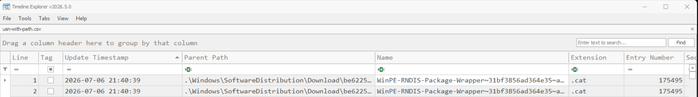

# USN Journal some reference

NTFS change history for file identities, names, and metadata. For an investigative workflow, see [cloud file hydration](../guides/usn-cloud-file-hydration.md).

**Checked September 7, 2026:** Microsoft documentation and the cited tool documentation/source.

## Acquisition targets

| Target on the source volume | Purpose |
| --- | --- |
| `C:\$Extend\$UsnJrnl:$J` | Named data stream containing journal records. |
| `C:\$Extend\$UsnJrnl:$Max` | Journal configuration metadata; preserve alongside `$J`. |
| `C:\$MFT` | File records for identity, metadata, and parent-path context. |
| Volume and journal metadata | Capture identity, available USN range, collection time, and snapshot provenance. |

Use a forensic collector capable of preserving NTFS metadata streams. The paths above are acquisition targets, not ordinary file-copy instructions. `$J` is an alternate data stream from `$UsnJrnl`. Preserve originals and parse working copies.

## Parse extracted copies

PowerShell examples with **illustrative paths**. Single quotes preserve literal `$MFT` and `$J` filenames. Outputs belong in a separate case directory.

```powershell
.\MFTECmd.exe -f 'C:\Case\working\$MFT' --csv 'C:\Case\output' --csvf mft.csv
.\MFTECmd.exe -f 'C:\Case\working\$J' --csv 'C:\Case\output' --csvf usn.csv
```

Optional parent-path resolution, **only if the installed help supports `-m`**:

```powershell
.\MFTECmd.exe -f 'C:\Case\working\$J' -m 'C:\Case\working\$MFT' --csv 'C:\Case\output' --csvf usn-with-paths.csv
```



Inspect one MFT entry and sequence, here the illustrative identity `624-5`:

```powershell
.\MFTECmd.exe -f 'C:\Case\working\$MFT' --de 624-5
```

The separate exports do not join automatically. `-m` resolves parents using the supplied MFT; it does not replay historical renames. The README and current source can describe different tool revisions, so retain the binary version, help output, invocation, and parse log with the case. [MFTECmd README](https://github.com/EricZimmerman/MFTECmd#readme), [MFTECmd argument and export code](https://github.com/EricZimmerman/MFTECmd/blob/master/MFTECmd/Program.cs). Alternatively, join `ParentEntryNumber` and `ParentSequenceNumber` to the MFT's `EntryNumber` and `SequenceNumber`, within the same volume and with the snapshot date recorded.

## Fields and identity

| Field or MFTECmd column | Use |
| --- | --- |
| `EntryNumber`, `SequenceNumber` | File reference split into entry and sequence. Keep both, plus volume identity. |
| `ParentEntryNumber`, `ParentSequenceNumber` | Parent identity recorded with the name. |
| `Name` | Name in this record, not a complete path. |
| `UpdateSequenceNumber` | USN; sort numerically within one journal instance. |
| `UpdateTimestamp` | Record time. Underlying USN timestamp is UTC; verify export/display conversion. |
| `UpdateReasons` | Decoded reason bitmask. Match constituent flags, not the whole string. |
| `FileAttributes` | Attributes recorded in this record. |
| `ParentPath` | Parser enrichment from the supplied MFT, if available. |
| `SourceFile` | Parser input provenance, not an actor or a journal identifier. |

The native V2 record also has `SourceInfo` and `SecurityId`. These are source flags and file security information, not a requesting PID or actor SID. Do not assume every native field is exported by your parser. Inspect the major record version before applying a binary layout; V2, V3, and V4 are different structures. [Microsoft: USN_RECORD_V2](https://learn.microsoft.com/en-us/windows/win32/api/winioctl/ns-winioctl-usn_record_v2), [V4 layout](https://learn.microsoft.com/en-us/windows/win32/api/winioctl/ns-winioctl-usn_record_v4).

To identify the record version, read the `MajorVersion` field in the common header:

```c++
typedef struct {
  DWORD RecordLength;   // offset 0x00
  WORD  MajorVersion;   // offset 0x04: 2, 3, or 4
  WORD  MinorVersion;   // offset 0x06
} USN_RECORD_COMMON_HEADER;
```

Example supplied from a Windows 11 `$J` extraction, with a record starting at file offset zero:

```bash
❯ xxd -l 8 '$J'
00000000: d800 0000 0200 0000
```

| Offset | Bytes | Field | Value |
|---|---|---|---|
| 0x00 | `d8 00 00 00` | `RecordLength` | 216 |
| 0x04 | `02 00` | `MajorVersion` | **2** |
| 0x06 | `00 00` | `MinorVersion` | 0 |

Official documentation: [Microsoft: Common header](https://learn.microsoft.com/en-us/windows/win32/api/winioctl/ns-winioctl-usn_record_common_header). 

### File identity versus record identity
**File join key:** `volume + entry + sequence`. **An MFT entry can be reused**. Keep both parent components when reconstructing paths, and reconcile renames against the time of the record. A current MFT path is only snapshot context.

### Repeated exports: one record in several captures
An older shadow copy and the current `$J` can contain the **same journal record**. Exporting both creates two CSV rows for that record. It does not mean the file changed twice.

Recover an earlier journal with VSS : 

```powershell
> vssadmin list shadows /for=C:
> .\MFTECmd.exe -f 'C:\$Extend\$UsnJrnl:$J' --vss --csv 'E:\Case\output\usn-vss'
```

Do not add `--vss` to an extracted `C:\Case\working\$J` expecting it to discover the original host's snapshots. MFTECmd would query the examiner's `C:`. 

For an **offline image**, use a VSS forensic reader (libvshadow, Arsenal Image Mounter, FTK Imager, plaso) to enumerate and extract each snapshot's `$J`, `$Max`, and `$MFT`; parse those copies separately.

**Synthetic example:** all captures below belong to the same volume. `A` and `B` are invented journal identifiers; USNs illustrate identity, not record sizes.

| Capture | Journal ID | USNs present |
| --- | --- | --- |
| Earlier shadow copy | A | 4096, 8192 |
| Current acquisition | A | 8192, 12288 |
| Capture after journal recreation | B | 8192 |

There are five exported rows, but four distinct record keys. The two `A / 8192` rows are candidates for consolidation. `B / 8192` stays separate even though its USN matches: the journal instance changed.
[Microsoft: Journal identifiers](https://learn.microsoft.com/en-us/windows/win32/fileio/using-the-change-journal-identifier).

To address this problem, Eric Zimmerman proposes the following approch using `MFTECmd.exe --dedupe`: it compares whole input artifacts by SHA-1. It does not merge overlapping records from two different `$J` files. [MFTECmd help](https://github.com/EricZimmerman/MFTECmd#readme).

## Common reason masks

Names below use SDK suffixes after `USN_REASON_`. These are selected flags, not the complete enumeration.

| Reason | Hex mask | Recorded change |
| --- | --- | --- |
| `DATA_OVERWRITE` | `0x00000001` | Existing unnamed-stream data overwritten. |
| `DATA_EXTEND` | `0x00000002` | Unnamed stream extended. |
| `DATA_TRUNCATION` | `0x00000004` | Unnamed stream shortened. |
| `NAMED_DATA_OVERWRITE` | `0x00000010` | Existing named-stream data overwritten. |
| `NAMED_DATA_EXTEND` | `0x00000020` | Named stream extended. |
| `NAMED_DATA_TRUNCATION` | `0x00000040` | Named stream shortened. |
| `FILE_CREATE` | `0x00000100` | File or directory created. |
| `FILE_DELETE` | `0x00000200` | File or directory deleted. |
| `SECURITY_CHANGE` | `0x00000800` | Security information changed. |
| `RENAME_OLD_NAME` | `0x00001000` | Name before rename. |
| `RENAME_NEW_NAME` | `0x00002000` | Name after rename. |
| `BASIC_INFO_CHANGE` | `0x00008000` | Basic attributes or timestamps changed. |
| `HARD_LINK_CHANGE` | `0x00010000` | Hard-link relationship changed. |
| `REPARSE_POINT_CHANGE` | `0x00100000` | Reparse-point data changed. |
| `STREAM_CHANGE` | `0x00200000` | Named stream added, removed, or renamed. |
| `CLOSE` | `0x80000000` | Closing summary boundary. |

Definitions: [Microsoft: USN record protocol specification](https://learn.microsoft.com/en-us/openspecs/windows_protocols/ms-fscc/d2a2b53e-bf78-4ef3-90c7-21b918fab304).

<u>Synthetic mask example:</u> `0x80008000` contains both `CLOSE` and `BASIC_INFO_CHANGE`. 

Reasons can accumulate between the first open and last close. A closing summary does not establish the order or number of all operations. Repeated changes of the same kind may not generate another record. There is no general-purpose file-read reason; reads can nevertheless cause other recorded changes. [Microsoft: Change journal records](https://learn.microsoft.com/en-us/windows/win32/fileio/change-journal-records).

>  For example, several write operations with no intervening close and reopen operations result in only one change record with the reason flag USN_REASON_DATA_OVERWRITE set.

## Attribute reminders

| Attribute | Hex mask | Caveat |
| --- | --- | --- |
| `DIRECTORY` | `0x00000010` | Separate directory activity when counting files. |
| `ARCHIVE` | `0x00000020` | Backup-related flag, not archive membership. |
| `SPARSE_FILE` | `0x00000200` | Does not measure locally available cloud content. |
| `REPARSE_POINT` | `0x00000400` | Not exclusive to cloud placeholders. |
| `OFFLINE` | `0x00001000` | Storage-availability hint; establish provider context. |
| `PINNED` | `0x00080000` | Keep-local intent, not transfer completion. |
| `UNPINNED` | `0x00100000` | Does not require the file to be wholly absent locally. |
| `RECALL_ON_DATA_ACCESS` | `0x00400000` | Content not fully local in the documented attribute context. |

Two attributes share the same mask, `0x00040000`:

- `FILE_ATTRIBUTE_EA`: A file or directory with extended attributes.
- `FILE_ATTRIBUTE_RECALL_ON_OPEN`: A virtual item without a local physical representation in this attribute view. It appears only in directory enumeration classes (`FILE_DIRECTORY_INFORMATION`, `FILE_BOTH_DIR_INFORMATION`, etc.). Opening it may fetch content. Do not confuse it with `RECALL_ON_DATA_ACCESS` above.

See the official documentation for more information [Microsoft: File attributes](https://learn.microsoft.com/en-us/windows/win32/fileio/file-attribute-constants).

## Interpretation checks

| Question | Check before concluding |
| --- | --- |
| Renamed or moved? | Follow the same `EntryNumber` and `SequenceNumber` on the same volume, then compare old/new names and parent references. |
| Deleted? | `FILE_DELETE` supports a deletion event. It doesn't prove overwrite, secure erasure, or recoverable content. |
| Sent to the Recycle Bin? | Follow the full file identity; seek matching rename/path and Recycle Bin metadata. |
| Hydrated? | Establish cloud context and before/after availability for each identity. `BasicInfoChange` alone is insufficient. See the [guide](../guides/usn-cloud-file-hydration.md). |
| No matching record? | Check retention, acquisition coverage, parser support, filters, and journal continuity. |

Record the retained time/USN range and collection provenance. Missing older records may require a historical snapshot or a search for surviving raw bytes, as described below. Neither method recovers the affected files' contents merely by recovering their journal records.

## Retention and recovering older records

### Why older records disappear
The journal is managed by size, not by a fixed retention period. New records are appended while older portions are eventually trimmed. `MaximumSize` (from `$UsnJrnl:$Max`) is a **target**, not a hard ceiling; NTFS can exceed it before trimming at a checkpoint. `AllocationDelta` controls allocation/deallocation increments. [Microsoft: Journal sizing](https://learn.microsoft.com/en-us/windows/win32/api/winioctl/ns-winioctl-create_usn_journal_data).

The `$J` stream is sparse. Trimming can replace its old data runs with sparse regions, which read as zeros through the logical file. The logical length can therefore be much larger than the allocated journal data. An extracted `$J` containing that zero-filled prefix does not contain the former records there. [libfsntfs: USN stream layout and trimming](https://github.com/libyal/libfsntfs/blob/main/documentation/New%20Technologies%20File%20System%20%28NTFS%29.asciidoc).

How far back the remaining records reach depends on activity and acquisition coverage. A busy volume can consume the same capacity much faster than a quiet one. 

### Decode `$UsnJrnl:$Max`
This is a 32-byte sample from a W11 host. Each eight-byte field as little-endian.

```text
00000000: 0000 0002 0000 0000 0000 8000 0000 0000  ................
00000010: 10da 4bbe 800d dd01 0000 0000 0000 0000  ..K.............
```

| Offset | Field | Decoded value |
| --- | --- | --- |
| `0x00` | `MaximumSize` | `0x02000000` = 33,554,432 bytes = **32 MiB** |
| `0x08` | `AllocationDelta` | `0x00800000` = 8,388,608 bytes = **8 MiB** |
| `0x10` | `UsnJournalID` | `0x01DD0D80BE4BDA10` = `134278410490599952` |
| `0x18` | `LowestValidUsn` | `0` |

The field offsets are implemented in [Get-UsnJrnlInfo](https://github.com/evild3ad/Get-UsnJrnlInfo/blob/main/Get-UsnJrnlInfo.ps1) by  Martin Willing.

For a live collection:

```powershell
> fsutil usn queryjournal C:

Usn Journal ID   : 0x01dd0d80be4bda10
First Usn        : 0x0000000015000000
Next Usn         : 0x0000000017108ea8
Lowest Valid Usn : 0x0000000000000000
Max Usn          : 0x00000fffffff0000
Maximum Size     : 0x0000000002000000 (32.0 MB)
Allocation Delta : 0x0000000000800000 ( 8.0 MB)
Minimum record version supported : 2
Maximum record version supported : 4
Write range tracking: Disabled
```

### Carve surviving records when snapshots are insufficient

!!! info
    I'm mentioning these two old tools here, but I haven't verified how they work in a lab. If I ever come across a case requiring them, I will explore them further.

Carving searches bytes for plausible USN structures without relying on the current `$J` allocation. Former journal clusters may survive in unallocated space until reused. One documented workflow uses [`UsnJrnlCarver`](https://github.com/jschicht/UsnJrnlCarver) to extract candidate pages, then [`UsnJrnl2Csv`](https://github.com/jschicht/UsnJrnl2Csv) to decode them.
