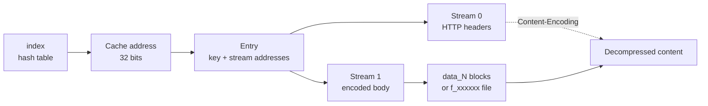
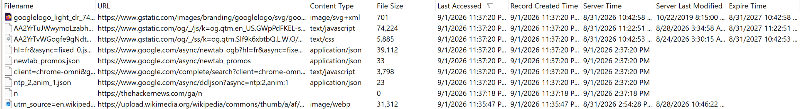
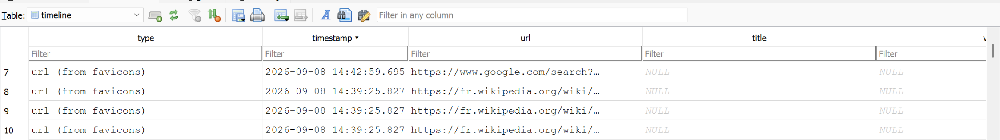

# Cache

History tells you a URL was requested. The cache tells you what came back, and keeps a copy of it. That is a different class of evidence: a page as it was served, an image, a script, a JSON response, with the fetch time attached. It also lives in a different store from the history database, which is why **clearing browsing history does not necessarily take it with it**. 

If you only want the tools, jump to [Chromium](#reading-the-chromium-cache-with-a-tool), [Firefox](#reading-the-firefox-cache-with-a-tool), or [Safari](#safari). Otherwise, the sections below work through how each cache is built.

## What a cached entry proves

A cache entry associates stored response data with a cache key and metadata. It does **not** by itself prove that a person requested or viewed the content. Entries can result from sub-resources, prefetching, service workers, browser activity, or extensions. Missing entries prove little: caching is selective, temporary, and bypassed by `no-store` and private browsing.

**The cache shows stored content, not who asked for it.** History, session data, and referrers provide evidence of human involvement.

You would typically only look for this artifact in very specific cases.

## The Chromium cache

*Verified on `Chromium 151.0.7922.173`.*

Every Chromium-based browser shares the same
[`net/disk_cache`](https://chromium.googlesource.com/chromium/src/+/HEAD/net/disk_cache/) source. What changes is where
the cache sits and, above all, which **backend** writes it. That backend depends on the operating system, not on the
browser.

On a distribution package, only Windows keeps the cache inside the profile:

| OS | Path |
| --- | --- |
| Windows | `<user data dir>\<Profile>\Cache\Cache_Data` |
| macOS | `~/Library/Caches/Chromium/<Profile>/Cache` |
| Linux | `~/.cache/chromium/<Profile>/Cache` |

*Substitute the vendor directory for Chrome, Edge, Brave and Opera. Some of them have no `Default` directory, Opera
among them.* The Linux row assumes a distribution package. See
[Linux: snap and flatpak move the root](profiles.md#linux-snap-and-flatpak-move-the-root).

The consequence to remember: an acquisition that copied `User Data` from a Mac or a Linux host contains no cache at all.

A profile holds not one cache but half a dozen, each with its own role. The one that matters here is the HTTP cache.

| Path, relative to the profile | Holds |
| --- | --- |
| `Cache/Cache_Data/` | The HTTP cache, the primary target |
| `Code Cache/js/`, `Code Cache/wasm/` | Bytecode compiled by V8 |
| `Service Worker/CacheStorage/` | The CacheStorage API, metadata in protobuf rather than `HttpResponseInfo` |
| `Service Worker/ScriptCache/` | Service worker scripts |
| `GPUCache/`, `ShaderCache/`, `GrShaderCache/`, `DawnCache/` | Compiled shaders |
| `Storage/ext/<id>/def/Code Cache/` | One cache per extension |

### Identifying the backend

Listing the directory is enough.

| What you see | Backend | Default on |
| --- | --- | --- |
| `index`, `data_0`…`data_3`, `f_xxxxxx` | **blockfile** | Windows |
| `index`, `the-real-index`, `<16 hex>_0`, `_1`, `_s` | **simple** | Linux, macOS, ChromeOS, Android |
| `sqldb0`, `sqldb1`, `shared_index` | **sql** | Nowhere |
| Nothing at all | **memory** | Private browsing |

Chromium ships three working backends (blockfile, simple and memory) and a fourth, sql, still experimental. Only the
first three are covered here. For sql, see its
[README](https://chromium.googlesource.com/chromium/src/+/HEAD/net/disk_cache/sql/README.md) and its
[design document](https://docs.google.com/document/d/1enmPPNr9aUY-_bBk5hNISsQEplk_Ud492eTkTF_r6u8/edit).

The files are located and the backend is identified. What sits inside them is the harder part. From
[`net/disk_cache/README.md`](https://chromium.googlesource.com/chromium/src/+/HEAD/net/disk_cache/README.md):

> There are two kinds of entries that can be stored: regular and sparse.
>
> Regular entries contain up to 3 separate data streams. Usually stream 0 would be used for some kind of primary small
> metadata (e.g. HTTP headers); stream 1 would contain the main payload (e.g. HTTP body); and stream 2 would optionally
> contain some auxiliary metadata that's needed only some of the time (e.g. V8 compilation cache).
>
> Sparse entries have a stream 0 and a separate sparse stream that's accessed with special methods that have Sparse in
> their names.

### The simple backend

One file per entry.

#### File names

The *entry hash* is the **first 8 bytes of the SHA-1 of the cache key**, read back as a little-endian 64-bit integer,
then printed as 16 hex digits. The byte order is therefore reversed against the SHA-1 that `sha1sum` prints.

```
SHA-1("http://www.amazon.com/")  ->  4b c8 f9 df c1 08 c4 7a ...
file name                        ->  7ac408c1dff9c84b_0
```

The suffixes you will meet:

| Suffix | Holds |
| ------- | ------- |
| `_0` | Stream 0 (HTTP metadata) **and** stream 1 (the body) |
| `_1` | Stream 2 (alternative data) |
| `_s` | Sparse data |
| `todelete_<hash>_<index>_<gen>` | A doomed entry, often still readable |

#### Inside a `_0` file

```
+-------------------------------+  offset 0
|  SimpleFileHeader             |  magic, version, key_length, key_hash
+-------------------------------+
|  key (not \0 terminated)      |
+-------------------------------+
|  stream 1 data (the body)     |
+-------------------------------+
|  SimpleFileEOF of stream 1    |
+-------------------------------+
|  stream 0 data (metadata)     |
+-------------------------------+
|  (optional) SHA-256 of the key|  32 bytes
+-------------------------------+
|  SimpleFileEOF of stream 0    |  <- end of file
+-------------------------------+
```

Structures to be identified; from [`simple/simple_entry_format.h`](https://chromium.googlesource.com/chromium/src/+/HEAD/net/disk_cache/simple/simple_entry_format.h).
```c
struct SimpleFileHeader {              struct SimpleFileEOF {
  uint64_t initial_magic_number;         uint64_t final_magic_number; // 8 bytes
  uint32_t version;                      uint32_t flags;       // 4 bytes
  uint32_t key_length;                   uint32_t data_crc32;  // 4 bytes
  uint32_t key_hash;                     int32_t  stream_size; // 4 bytes
};                                     };
```
Each structure contains recognizable constants:

- `0xfcfb6d1ba7725c30`, the initial magic
- `0xf4fa6f45970d41d8`, the final magic
- `0xeb97bf016553676b`, the sparse range header
- Flags: bit 0 = CRC32 present, bit 1 = SHA-256 of the key present
- Integers are **little-endian**, so read them right to left

!!! warning 
     Both structures hold 20 bytes of fields but occupy **24** in memory, and 24 is what reaches the
     disk, since the code writes the structure in one go, `sizeof()` bytes at a time.

    *The C/C++ rule has two parts. A structure takes the alignment of its most constraining member, here the leading
    `uint64_t`, so 8. And its size must be a multiple of that alignment, so that every element of an array stays aligned.*


The 20 bytes of fields are therefore rounded up to 24 by trailing padding:

```
0        8         12          16           20          24
| uint64 |  uint32  |  uint32   |  uint32    |  ~~~~~~   |
  magic     version    key_len     key_hash     padding
```

The key therefore starts at offset 24, not 20.

**SimpleFileHeader**, on an entry taken at random:

```bash
❯ xxd 3225589b73ba96cb_0 | head -n 2
00000000: 305c 72a7 1b6d fbfc 0500 0000 5e00 0000  0\r..m......^...
00000010: 4e53 3ca3 0000 0000 312f 302f 5f64 6b5f  NS<.....1/0/_dk_
```

| Offset | Bytes                     | Meaning                                    |
|--------|---------------------------|--------------------------------------------|
| 0x00   | 30 5c 72 a7 1b 6d fb fc   | magic = `0xfcfb6d1ba7725c30` (little-endian) |
| 0x08   | 05 00 00 00               | version = 5                                |
| 0x0c   | 5e 00 00 00               | key_length = 0x5e = 94                     |
| 0x10   | 4e 53 3c a3               | key_hash = 0xa33c534e                      |
| 0x14   | 00 00 00 00               | alignment padding                          |
| 0x18   | 31 2f 30 2f 5f 64 6b 5f   | start of the key: `1/0/_dk_`               |

The key is 94 bytes long and starts at 24, so it ends at 118, `0x76`, where stream 1 begins.

```bash
❯ head -c 118 3225589b73ba96cb_0 | xxd
00000000: 305c 72a7 1b6d fbfc 0500 0000 5e00 0000  0\r..m......^...
00000010: 4e53 3ca3 0000 0000 312f 302f 5f64 6b5f  NS<.....1/0/_dk_
00000020: 6874 7470 733a 2f2f 782e 636f 6d20 6874  https://x.com ht
00000030: 7470 733a 2f2f 782e 636f 6d20 6874 7470  tps://x.com http
00000040: 733a 2f2f 6162 732e 7477 696d 672e 636f  s://abs.twimg.co
00000050: 6d2f 782d 7765 622f 782d 7765 622f 6173  m/x-web/x-web/as
00000060: 7365 7473 2f75 7469 6c73 2d42 4d4e 6233  sets/utils-BMNb3
00000070: 5763 482e 6a73                           WcH.js
```

The key is not the URL. The HTTP cache is partitioned (double keying):

```
1/0/_dk_https://x.com https://x.com https://abs.twimg.com/x-web/x-web/assets/utils-BMNb3WcH.js
└───┬──┘└─────┬─────┘ └─────┬─────┘ └────────────────────────────┬───────────────────────────┘
    │         │             │                                    └─ the URL actually fetched
    │         │             └─ frame site
    │         └─ top-level site
    └─ partitioning prefix
```

The URL actually fetched is the last field. You cannot reach an entry from a URL without rebuilding the exact key, so
you read the key out of the file, never the reverse.

The bytes that follow belong to the payload, and its magic number identifies it:

```bash
❯ xxd -s 118 -l 16 3225589b73ba96cb_0
00000076: 1f8b 0800 0000 0000 0000 cc58 5b53 e33a  ...........X[S.:
```

`1f 8b`: the gzip magic number.

**The body is stored encoded.** If the response carried `Content-Encoding: gzip`, `br` or `zstd`, the compressed
version is what sits on disk. The header that says so lives in a separate stream, never beside the body.

**SimpleFileEOF**, on the same entry:

```bash
❯ xxd 3225589b73ba96cb_0 | tail -n 2
000023c0: 9e97 5c46 81d8 410d 9745 6ffa f403 0000  ..\F..A..Eo.....
000023d0: 0051 7881 e2b4 1900 0000 0000 00         .Qx..........
```

| Offset   | Bytes                     | Meaning                                    |
|----------|---------------------------|--------------------------------------------|
| 0x23C5   | d8 41 0d 97 45 6f fa f4   | magic = `0xf4fa6f45970d41d8` (little-endian) |
| 0x23CD   | 03 00 00 00               | flags = 3                                  |
| 0x23D1   | 51 78 81 e2               | data_crc32 = 0xE2817851                    |
| 0x23D5   | b4 19 00 00               | stream_size = 0x19B4 = 6580                |
| 0x23D9   | 00 00 00 00               | alignment padding                          |

#### Decoding `flags`

`flags` is not a quantity but a **bit mask**: independent switches, each answering yes or no. The value is only their
state written in decimal.

```
flags   = 03 00 00 00  ->  3
binary  = 00 00 00 11
                   ││
                   │└──  bit 0 (value 1) = CRC32 present
                   └───  bit 1 (value 2) = SHA-256 of the key present
```

| Value | Binary | CRC32 | SHA-256 | Effect when reading |
| ------ | ------- | ----- | ------- | -------------------------- |
| 0 | `00` | no | no | Nothing between stream 0 and the EOF |
| 1 | `01` | yes | no | Nothing between stream 0 and the EOF |
| 2 | `10` | no | yes | **32 bytes** to subtract |
| 3 | `11` | yes | yes | **32 bytes** to subtract |

Chromium defines these flags by shifting, which yields the value of the bit concerned:

```c
enum SimpleFileEOFFlags {
  FLAG_HAS_CRC32      = 1 << 0,   // 1
  FLAG_HAS_KEY_SHA256 = 1 << 1,   // 2
};
```

So never compare `flags` to an integer: a future bit 2 would turn 3 into 7 and break the test. Isolate the bit with a
binary AND.

```bash
f=3225589b73ba96cb_0
flags=$(tail -c 24 "$f" | od -An -tu4 -j8 -N4 --endian=little | tr -d ' ')

# Is bit 0 set?
[ $((flags & 1)) -ne 0 ] && echo "bit 0: CRC32 present"

# Is bit 1 set?
[ $((flags & 2)) -ne 0 ] && echo "bit 1: SHA-256 present (32 bytes)"
```

Here `flags = 3`, so the 32 bytes of the SHA-256 count in the arithmetic below.

#### Working out stream 1

Every segment is known except one. The size of stream 1 is written nowhere: the `stream_size` field in the stream 1 EOF
exists but is left unset, it only carries the size of stream 0. The body is deduced by subtraction.

```
stream 1 = total size - header - key - stream 1 EOF - stream 0 - SHA-256 - stream 0 EOF
stream 1 = 9181 - 24 - 94 - 24 - 6580 - 32 - 24
stream 1 = 2403
```

Which gives:

```
0x0000 → 0x0018       24 B   header
0x0018 → 0x0076       94 B   key
0x0076 → 0x09D9     2403 B   stream 1, the gzip body
0x09D9 → 0x09F1       24 B   stream 1 EOF
0x09F1 → 0x23A5     6580 B   stream 0, HTTP metadata
0x23A5 → 0x23C5       32 B   SHA-256 of the key
0x23C5 → 0x23DD       24 B   stream 0 EOF
```

Repeat the exercise on your own entry. The arithmetic is fragile: one wrong figure upstream shifts everything after it.

Extraction:

```bash
❯ dd if=3225589b73ba96cb_0 bs=1 skip=118 count=2403 2>/dev/null | gunzip -c > utils.js
```

### The blockfile backend

The historical format, still the default for the HTTP cache on Windows. Where the simple backend writes one file per
entry, blockfile behaves like a miniature filesystem.

| File | Role |
| ------- | ---- |
| `index` | Header, plus a hash table of 65,536 cells pointing at entries |
| `data_0` | Block file of **36** byte blocks, the `RankingsNode` records |
| `data_1` | Block file of **256** byte blocks, the `EntryStore` records |
| `data_2` | Block file of **1024** byte blocks |
| `data_3` | Block file of **4096** byte blocks |
| `f_xxxxxx` | One file per blob larger than `kMaxBlockSize`, 16,384 bytes |

*When a block file saturates (around 65,000 blocks), the next one is created and chained: each header carries the
number of the file that follows. However long the chain gets, any block stays directly reachable through its address.*

Nothing is designated by a path. Everything goes through a 32-bit cache address encoding the storage type, the file
concerned, the starting block and the number of contiguous blocks. The metadata of an entry occupies one 256 byte
block. The response body fits in one or more blocks, or moves out to a separate `f_xxxxxx` file beyond 16,384 bytes.



Two points are worth keeping for an analysis:

- Entries are not deleted but **marked**, as evicted or as doomed, and stay readable until their blocks are
  reallocated. A parser therefore sees more than the browser does.
- The format keeps metadata the simple backend does not: creation time, last access time and two reuse counters, which
  separate repeated use from a single visit.

I stop here deliberately. Covering blockfile at the depth given to the simple backend would mean the allocation tables, the chaining between block files and the reassembly of sparse entries, for a format that concerns one platform only and whose future is uncertain: Chromium is already working on a SQL backend meant to replace both others. The time it would take does not match what it would be used for.

The tooling settles it anyway: everything under
[Reading the Chromium cache with a tool](#reading-the-chromium-cache-with-a-tool) opens a blockfile directory and hands
you the entries, `cachetool` included.

For the format itself, the reference sources:

- Chromium's [Disk Cache design document](https://www.chromium.org/developers/design-documents/network-stack/disk-cache/):
  index, block files, addresses, and the split between `EntryStore` and `RankingsNode`.
- [`net/disk_cache/blockfile/disk_format.h`](https://chromium.googlesource.com/chromium/src/+/main/net/disk_cache/blockfile/disk_format.h):
  the structures and their `static_assert`s.
- [`net/disk_cache/blockfile/addr.h`](https://chromium.googlesource.com/chromium/src/+/main/net/disk_cache/blockfile/addr.h):
  the binary layout of the cache address.
- libyal / dtformats,
  [*Chrome Cache file format*](https://github.com/libyal/dtformats/blob/main/documentation/Chrome%20Cache%20file%20format.asciidoc):
  the most complete community documentation.

### Reading the Chromium cache with a tool

None of what follows has to be done by hand. Four tools read a Chromium cache directory, whichever backend wrote it.

| Tool | Covers | Output |
| --- | --- | --- |
| [ChromeCacheView](https://www.nirsoft.net/utils/chrome_cache_view.html) | The Chromium cache alone | Interactive list, plus CSV, tab-delimited, HTML or XML |
| [Hindsight](https://github.com/RyanDFIR/hindsight) | Profile **and** cache, merged | XLSX, JSONL, SQLite |
| [plaso](https://github.com/log2timeline/plaso) | The cache inside a full system timeline | Plaso storage, then `psort.py` to CSV or JSON |
| `cachetool` | Both backends, from the command line | stdout |

ChromeCacheView lists every entry with its URL, content type, size, timestamp columns, and more. It also carries a
`Server IP Address` column, which Hindsight doesn't.



- Timestamps are rendered in the local time of the machine running the tool, not in UTC, and no timezone is shown.
- Filtering is a single keyword search across the table, with no per-column filter.
- To get the table out, select everything and use `Save Selected Items` for CSV, or skip the GUI entirely with
  `ChromeCacheView.exe /scomma <file>`.

Hindsight, for **a timeline**. It parses the profile and the cache together and merges both into one `timeline` table,
so a cached response sits next to the visit that fetched it.



For the cache on its own I reach for ChromeCacheView, which gets me to the entry I want faster. Hindsight earns its place when the cache has to sit in the same timeline as the profile. plaso is the odd one out: you reach for it when the browser cache is one source among many, not when it is the question, and its Chromium work lives in [`chrome_cache.py`](https://github.com/log2timeline/plaso/blob/main/plaso/parsers/chrome_cache.py).

[`cachetool`](https://chromium.googlesource.com/chromium/src/+/main/net/tools/cachetool/cachetool.cc), Chromium's own tool, reads either backend from the command line:

```bash
cachetool <path> blockfile list_keys
cachetool <path> blockfile get_stream "<key>" 1
```

**Getting the file itself out.** In ChromeCacheView, select the entries and press ++f4++ (`Copy Selected Cache Files
To`). By hand, copy the cache file out, run `file` on it, and give it the matching extension: the cache stores payloads
without one.


## Firefox: cache2

*Verified on `Firefox 154.0.1`.*

In the **local** profile root, never the roaming one:

| OS | Path |
| --- | --- |
| Windows | `%LOCALAPPDATA%\Mozilla\Firefox\Profiles\<profile>\cache2` |
| macOS | `~/Library/Caches/Firefox/Profiles/<profile>/cache2` |
| Linux | `~/.cache/mozilla/firefox/<profile>/cache2` |

Names are defined in [`CacheFileIOManager.h`](https://searchfox.org/firefox-main/source/netwerk/cache2/CacheFileIOManager.h#47-49): 

| Name | What it is |
| --- | --- |
| `entries/` | The live cache. One file per entry, named after the SHA-1 of the cache key in hex |
| `doomed/` | A transient holding area, normally empty |
| `trash/` | Old cache directories Firefox renamed for background deletion, so clearing the cache doesn't block browsing.| 

`doomed/`:

- Firefox moves an entry there only when it dooms (marks for deletion) a file that is still open, so the handle can be
  released first.
- The directory is emptied when the cache tree is created, so it's empty after a restart.
- Files inside it are renamed to a random integer.

The filename is the SHA-1 of the **key**, not of the URL. The key is a `<context>,:<enhance-id:><uri>` string, where
the context encodes origin attributes such as private browsing, container and site isolation. Reaching a filename from
a URL means rebuilding that key byte for byte, so you read the key out of the file, never the reverse.

On a live host, `about:cache` lists everything Firefox currently holds, with entry keys and fetch counts, which beats
parsing when the machine is in front of you.

### How an entry file is laid out

Data first, metadata last, and four bytes at the very end that tie the two together.

```
+-----------------------------+  offset 0
|  data: the HTTP body,       |
|  in 256 KiB chunks          |
+-----------------------------+  <- metadata offset
|  metadata hash      (4 B)   |
|  chunk hashes    (2 B x N)  |
|  header                     |  fetch count, last fetched, expiration, key size
|  key + \0                   |  the URL
|  elements                   |  name\0value\0: response-head, security-info...
+-----------------------------+
|  metadata offset    (4 B)   |  <- the last four bytes of the file
+-----------------------------+
```

Two facts carry everything below:

- **The last four bytes are the metadata offset.** The metadata block starts exactly where the data ends, so that one
  number is also the size of the payload.
- **Metadata integers are big-endian.** Read those four bytes little-endian and you get a size in the billions. That
  absurd number is the tell that you read them the wrong way round.

The field layout of the header and the element names are in Mozilla's
[HTTP Cache documentation](https://firefox-source-docs.mozilla.org/networking/cache2/doc.html#on-disk-entry-format), under *On-disk entry
format*.

### Carving the payload back out

Offset 0 holds the HTTP response body exactly as it came off the wire, with no wrapper and no extension. Two cases,
both from an `MZCacheView` export *(the tool is covered under
[Reading the Firefox cache with a tool](#reading-the-firefox-cache-with-a-tool))*:


| Cached file | Content type | `Content-Encoding` | Size | Entry file |
| --- | --- | --- | --- | --- |
| `wikipedia.png` | `image/png` | none | 13,444 | `3F26CEA7…6146F7` |
| `wikipedia-tagline-fr.svg` | `image/svg+xml` | `gzip` | 2,769 | `9662E630…DD4636` |

1\. **Stored as sent.** The PNG starts with its own magic number, right at offset 0:

```bash
❯ xxd 3F26CEA7A1D1D64D477D57C93A131EF0216146F7 | head -n 1
00000000: 8950 4e47 0d0a 1a0a 0000 000d 4948 4452  .PNG........IHDR
```

You could hunt for the `IEND` chunk that closes a PNG, but the format hands you the boundary without guessing. The tail
shows the elements running out, then the four bytes that matter:

```bash
❯ xxd 3F26CEA7A1D1D64D477D57C93A131EF0216146F7 | tail -n 1
000070b0: 0000 0400 0034 84                        .....4.
```

`00 00 34 84` big-endian is `0x3484` = 13444, which is the size the tool reported. Little-endian would give
`0x84340000` = ~ 2.2 billion. Cut there and check:

```bash
❯ head -c 13444 3F26CEA7A1D1D64D477D57C93A131EF0216146F7 > picture.png

❯ file picture.png
picture.png: PNG image data, 100 x 100, 8-bit/color RGBA, non-interlaced

# File recovered
❯ sha256sum picture.png 
94f7729893505b73b9360f51c67074cf44d31a096f25088699ca290fa39cced0  picture.png

# File from the official site
❯ sha256sum wikipedia.png
94f7729893505b73b9360f51c67074cf44d31a096f25088699ca290fa39cced0  wikipedia.png
```

Byte for byte the file the server sent.

2\. **Stored encoded.** Same procedure, one extra step. The SVG was served gzipped, so that is what is on disk:

```bash
❯ xxd 9662E630990413AE41C3745B726C98E6B4DD4636 | head -n 1
00000000: 1f8b 0800 0000 0000 0003 cd5a 4d8f 1c37  ...........ZM..7
```

`1f 8b`, a gzip stream, matching the `gzip` in the encoding column. The tail gives the offset the same way:

```bash
❯ xxd 9662E630990413AE41C3745B726C98E6B4DD4636 | tail -n 1
00004750: 3400 0000 0004 0000 0ad1                 4.........
```

`00 00 0A D1` big-endian is `0x0AD1` = 2769.

!!! warning "Why `file` reports the wrong size"

    Run `file` on that entry and it reports a decompressed size of 3507093504.

    ```bash
    ❯ file 9662E630990413AE41C3745B726C98E6B4DD4636
    9662E630990413AE41C3745B726C98E6B4DD4636: gzip compressed data, from Unix, original size modulo 2^32 3507093504 gzip 
    compressed data, unknown method, ASCII, has comment, from FAT filesystem (MS-DOS, OS/2, NT), original size modulo 2^32 3507093504
    ```

    A gzip stream stores its uncompressed size in **the last four bytes of its own stream**, so `file` reads the last four
    bytes of whatever you hand it. Here those bytes belong to the cache, not to gzip.

```bash
❯ head -c 2769 9662E630990413AE41C3745B726C98E6B4DD4636 | gunzip -c > image.svg

# File recovered
❯ sha256sum image.svg 
ffb822e9f490ebb83dca1ac9705f20ed82131da45561f3ba1742b77b86edc59c  image.svg

# File from the official site
❯ sha256sum wikipedia-tagline-fr.svg
ffb822e9f490ebb83dca1ac9705f20ed82131da45561f3ba1742b77b86edc59c  wikipedia-tagline-fr.svg
```

Which decompressor to reach for is in the `response-head` element, in the `Content-Encoding` header. The full set is in
MDN's [Content-Encoding](https://developer.mozilla.org/en-US/docs/Web/HTTP/Reference/Headers/Content-Encoding); in
practice you will meet `gzip`, `br` and increasingly `zstd`.

The procedure scripts easily, but three things break it. Check them before calling an entry corrupt.

- **`alt-data`.** When that element is present the data area holds the HTTP body *followed by* an alternative
  representation (usually JavaScript bytecode precompiled by SpiderMonkey). Its value is `<offset>,<type>`, and that
  offset, not the metadata offset, is where the body ends.
- **Encryption at rest.** With `browser.cache.disk.encryption.enabled` set, each chunk and the metadata are separate
  AES-256-GCM blocks keyed from the profile keystore. Everything above returns noise and there is no offline way
  around it.
- **It may never have hit the disk.** "Private browsing" entries are memory only, and Firefox keeps a pool of recent
  entry metadata in memory as well.

### Reading the Firefox cache with a tool

None of this is work you have to do by hand. These read cache2 and hand you the URLs, the content types and the
timestamps directly.

| Tool | Covers | Output |
| --- | --- | --- |
| [MZCacheView](https://www.nirsoft.net/utils/mozilla_cache_viewer.html) | The Firefox cache alone | Interactive list, plus CSV, tab-delimited, HTML or XML |
| [Hindsight](https://github.com/RyanDFIR/hindsight) | Profile **and** cache, Firefox since v2026.06 | XLSX, JSONL, SQLite |
| [plaso](https://github.com/log2timeline/plaso) | The cache inside a full system timeline | Plaso storage, then `psort.py` to CSV or JSON |

MZCacheView is ChromeCacheView's twin for cache2: same list, same columns, same export, same ++f4++ to copy the
payloads out. Everything said under
[Reading the Chromium cache with a tool](#reading-the-chromium-cache-with-a-tool) applies here, local time included.

plaso registers two Firefox names in
[`firefox_cache.py`](https://github.com/log2timeline/plaso/blob/main/plaso/parsers/firefox_cache.py): `firefox_cache2`
for Firefox 32 and later, which is the format described above, and `firefox_cache` for anything older.

## Timestamps in a cache entry

An entry carries two kinds of clock, and they answer different questions. One belongs to the host, one to the server
that served the response.

| Family | Where | Fields | Epoch and unit |
| --- | --- | --- | --- |
| Chromium, both backends | Stream 0, a serialized `HttpResponseInfo` | `request_time`, `response_time` | 1601, microseconds |
| Chromium blockfile | `EntryStore` in `data_1`, `RankingsNode` in `data_0` | `creation_time`, `last_used` | 1601, microseconds |
| Firefox cache2 | Metadata header | `mLastFetched`, `mLastModified`, `mExpirationTime` | 1970, seconds, big-endian |
| Both | The stored response headers | `Date`, `Last-Modified`, `Expires` | HTTP-date, supplied by the server or intermediary |
| Both | The stored response headers | `Age` | Duration in seconds, not a calendar timestamp |

Chromium's pair says when the request went out and when the headers came back. On a revalidated entry both are the
times of the **last** validation, not of the first fetch, so an old body can carry a recent timestamp.

Firefox's `mLastFetched` is the last access, and `mFetchCount` sits beside it. One fetch, or a fetch count of forty,
describe two different behaviors for the same URL.

The header dates come from the origin, or from a CDN in front of it.

Convert with the epochs in [Timestamps](timestamps.md). Two habits: NirSoft tools render everything in the local time
of the machine running them, with no timezone shown, and Firefox metadata integers are big-endian.

## Safari

!!! note "Safari lab verification"

    This information is currently based on documentation and older versions of macOS; lab verification (latest macOS + Safari versions) will be conducted shortly.

Identify the format before choosing a query. Legacy Safari acquisitions can contain a CFNetwork `Cache.db`;
WebKit also implements a separate binary **NetworkCache**. Finding one does not make the other irrelevant.

### Locate and preserve the cache

Check the acquired user's `Library/Caches/` and Safari container's `Data/Library/Caches/`. Legacy locations include
`~/Library/Caches/com.apple.Safari/Cache.db`. WebKit's [Cocoa path code](https://github.com/WebKit/WebKit/blob/main/Source/WebKit/UIProcess/WebsiteData/Cocoa/WebsiteDataStoreCocoa.mm)
uses a `WebKit/NetworkCache` suffix for its default cache path, but an application can supply a different base
storage directory. Do not derive every profile's cache path from its `History.db` location.

To inventory both formats in a copied user Library:

```bash
find "/path/to/copied-user/Library" \
  \( -type f -name 'Cache.db' \) -o \
  \( -type d -name 'NetworkCache' \)
```

This can also find other applications' caches. Keep the owning container and full path with the results. Collect
whole cache directories, including companion files, rather than selecting only files with recognizable extensions.

### Legacy CFNetwork Cache.db

First check that the database has the expected tables. The [documented legacy schema](https://gist.github.com/alaborie/1305158)
is a useful reference, not a promise that every file named `Cache.db` has this layout.

| Table | Relevant fields |
| --- | --- |
| `cfurl_cache_response` | `entry_ID`, `request_key`, `time_stamp` |
| `cfurl_cache_blob_data` | Serialized request and response objects |
| `cfurl_cache_receiver_data` | `receiver_data`, the stored body BLOB |

On a working copy, inspect the schema before joining records by `entry_ID`:

```sql
PRAGMA table_info(cfurl_cache_response);
PRAGMA table_info(cfurl_cache_receiver_data);

SELECT r.entry_ID,
       r.request_key,
       r.time_stamp AS cache_time_raw,
       length(d.receiver_data) AS stored_body_bytes
FROM cfurl_cache_response AS r
LEFT JOIN cfurl_cache_receiver_data AS d ON d.entry_ID = r.entry_ID
ORDER BY r.entry_ID;
```

Keep `time_stamp` as stored until its representation is established. Do not apply Safari history's 2001 offset to
it merely because both databases came from Safari. A NULL body length means this join found no body BLOB, not that
the response was empty.

Export a selected `receiver_data` BLOB as binary data in your SQLite viewer. Interpret the response object for its
content type and encoding, then decode the exported body if needed. Retain both the stored bytes and the decoded
file, with the entry ID and URL that link them. Renaming the database or a serialized response object to `.html`
does not extract the response body.

### WebKit NetworkCache

WebKit's [storage implementation](https://github.com/WebKit/WebKit/blob/main/Source/WebKit/NetworkProcess/cache/NetworkCacheStorage.cpp)
uses versioned directories, `Records`, and `Blobs`. Small bodies can be stored inside records; others use separate
blob storage. Preserve both trees and the `salt` file. A records-only collection can lose response bodies.

```text
NetworkCache/
    Version <n>/
        salt
        Records/
        Blobs/
```

The [entry implementation](https://github.com/WebKit/WebKit/blob/main/Source/WebKit/NetworkProcess/cache/NetworkCacheEntry.cpp)
serializes the response separately from the body. It validates decoded metadata with a checksum. This is neither
SQLite nor the Chromium simple-cache layout, so the earlier SQL and fixed-offset extraction examples do not apply.

For a parser or manual examination, retain the cache key, response URL, status and headers, record timestamp, and
body association. Check the on-disk version against the parser's supported format before trusting an export.
Readable strings can help locate a candidate record, but they cannot establish its body boundary or reconstruct
missing blobs.

These details describe the linked WebKit source. They are not a Safari lab validation across macOS releases.
Correlate recovered content with the relevant [profile](profiles.md#safari) and [session records](sessions.md#safari);
a cached resource alone does not establish a local page view.

---

<small>
**Cache formats**, from the Chromium and Mozilla sources ·
[Disk cache design](https://www.chromium.org/developers/design-documents/network-stack/disk-cache/) ·
[`blockfile/disk_format.h`](https://chromium.googlesource.com/chromium/src/+/main/net/disk_cache/blockfile/disk_format.h) ·
[Simple Cache backend](https://www.chromium.org/developers/design-documents/network-stack/disk-cache/very-simple-backend/) ·
[`simple/simple_entry_format.h`](https://chromium.googlesource.com/chromium/src/+/main/net/disk_cache/simple/simple_entry_format.h) ·
[`disk_cache.cc`](https://chromium.googlesource.com/chromium/src/+/main/net/disk_cache/disk_cache.cc) for the backend
default per platform ·
[`chrome_paths_linux.cc`](https://chromium.googlesource.com/chromium/src/+/main/chrome/common/chrome_paths_linux.cc)
for the cache fallback ·
[HTTP Cache](https://firefox-source-docs.mozilla.org/networking/cache2/doc.html) for the cache2 on-disk entry
format, alongside
[`CacheFileMetadata.h`](https://searchfox.org/firefox-main/source/netwerk/cache2/CacheFileMetadata.h),
[`CacheFileIOManager.h`](https://searchfox.org/firefox-main/source/netwerk/cache2/CacheFileIOManager.h) and
[`CacheFileChunk.h`](https://searchfox.org/firefox-main/source/netwerk/cache2/CacheFileChunk.h) for `kChunkSize`
</small>

<small>
**Tools** ·
[ChromeCacheView](https://www.nirsoft.net/utils/chrome_cache_view.html) and
[MZCacheView](https://www.nirsoft.net/utils/mozilla_cache_viewer.html), NirSoft, Windows only ·
[Hindsight](https://github.com/RyanDFIR/hindsight) for the profile and the cache in one timeline ·
[plaso](https://github.com/log2timeline/plaso), parsers
[`chrome_cache.py`](https://github.com/log2timeline/plaso/blob/main/plaso/parsers/chrome_cache.py) and
[`firefox_cache.py`](https://github.com/log2timeline/plaso/blob/main/plaso/parsers/firefox_cache.py) ·
`cachetool`, from the Chromium tree
</small>

<small>
**Further reading** ·
[Extract artifacts from browser cache](https://www.forensicsinsider.com/cybersecurity/extract-artifacts-from-browser-cache/) ·
[Firefox cache file format](https://github.com/libyal/dtformats/blob/main/documentation/Firefox%20cache%20file%20format.asciidoc) (libyal)
</small>
