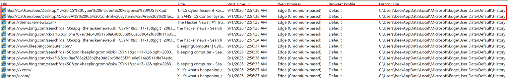
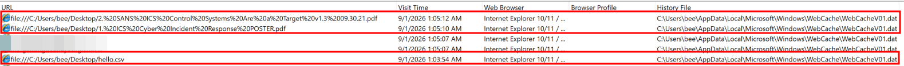
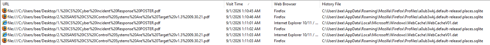

# WebCacheV01.dat, the second history on Windows

`WebCacheV01.dat` is a WinINet ESE database at `%LOCALAPPDATA%\Microsoft\Windows\WebCache\`.
It stored history, cache metadata, cookies, and downloads for Internet Explorer and legacy Edge, but its records
can also reflect local file activity.

I started with information suggesting that this artifact could establish local file access. The lab tests below
examined which actions produced records, and whether those records distinguished opening a file from downloading it.

## Lab environment

| Component | Tested environment |
| --- | --- |
| Operating system | Windows 11 Pro 25H2, build 10.0.26200 |
| Firefox | 154.0.1 |
| Firefox settings and extensions | Default configuration, plus tests with Enhanced Tracking Protection, uBlock Origin, Privacy Badger, and CanvasBlocker |
| Result across tested Firefox configurations | The same WebCache behavior was observed |

The host had never had Internet Explorer or legacy Edge installed, yet the database was present. Edge Chromium
and Timeline Explorer were also used in the comparisons below. These are observations from this lab, not a rule
for every Windows build, file type, or browser configuration.

The `WebCache` directory does not show even with "Show hidden items" enabled with Explorer. Use the full path, or a 
shell:

```powershell
Get-ChildItem -Force $env:LOCALAPPDATA\Microsoft\Windows\WebCache
# cmd equivalent: dir /a
```

A scheduled task held the database open. `handle.exe` from Sysinternals showed the handle:

```
> handle.exe .\WebCacheV01.dat

Nthandle v5.0 - Handle viewer
Copyright (C) 1997-2022 Mark Russinovich
Sysinternals - www.sysinternals.com

taskhostw.exe   pid: 6496   type: File   3D0: C:\Users\bee\AppData\Local\Microsoft\Windows\WebCache\WebCacheV01.dat
```

`taskhostw.exe` is the generic host for scheduled tasks. The task is **CacheTask**, its action a custom handler.
[BrowsingHistoryView](https://www.nirsoft.net/utils/browsing_history_view.html) names it too, because it has to stop it to read the file:

> Version 2.10: Added new option: 'Automatically stop the cache task of IE10/IE11/Edge for unlocking the database
> file.' If this option is turned on, BrowsingHistoryView automatically stops the 'CacheTask' Scheduled task to unlock
> the database file of IE10/IE11/Edge (WebCacheV01.dat).

## Collecting it

The lock breaks a plain copy. `BrowsingHistoryView` reads it in place anyway, stopping CacheTask for you. For an
acquisition, take the `V01*.log` transaction logs too: recent entries land there first and are folded into the `.dat`
later.

```powershell title="Volume Shadow Copy, elevated"
# 1. Create a shadow copy vssadmin create shadow is Server only
Invoke-CimMethod -ClassName Win32_ShadowCopy -MethodName Create -Arguments @{ Volume = "C:\"; Context = "ClientAccessible" }

# 2. Read back the device path of the copy you just made
vssadmin list shadows

# 3. Expose it. The trailing backslash is required, mklink fails silently without it
cmd /c mklink /d C:\vsc "\\?\GLOBALROOT\Device\HarddiskVolumeShadowCopy1\"

# 4. Take the directory
Copy-Item "C:\vsc\Users\<user>\AppData\Local\Microsoft\Windows\WebCache\*" -Destination E:\evidence\WebCache\

# 5. Clean up
cmd /c rmdir C:\vsc
vssadmin delete shadows /shadow={<id from step 2>}
```

```powershell title="KAPE, elevated"
# The InternetExplorer target copies the WebCache directory
.\kape.exe --tsource C: --tdest E:\evidence --target InternetExplorer

# Add --vss for the shadow copies on the volume
.\kape.exe --tsource C: --tdest E:\evidence --target InternetExplorer --vss
```

Use `InternetExplorer`, not `EdgeChromium`, even where Edge is the only browser installed. `EdgeChromium.tkape` never
leaves `AppData\Local\Microsoft\Edge\User Data\`. The directory you want belongs to Internet Explorer.

## What it actually records

The tests focused on local files. Three runs of `BrowsingHistoryView` compare entries in the browser databases
with entries in `WebCacheV01.dat`. They do not redefine this database as exclusively a local-file log.

**First run. Two local PDFs opened from inside Edge Chromium.**



Both `file:///` rows come from Edge's own `History`, with the web traffic below them. Nothing in `WebCacheV01.dat`.

**Second run. The same two PDFs double-clicked from Explorer, opening in Firefox, plus a CSV opened from Timeline
Explorer.**



Every row now comes from `WebCacheV01.dat`, labeled Internet Explorer 10/11. The PDFs opened in Firefox. `hello.csv`
never went near a browser: Timeline Explorer opened it. These rows support local file activity beyond legacy
browser use. The tool's Internet Explorer label identifies its data source; it does not identify the application
that opened the file.

**Third run. The control: the same files, opened two different ways.**



The two earliest rows exist only in Firefox's `places.sqlite`. Those were dragged and dropped onto an already-open
Firefox window. The later rows appear twice, in `places.sqlite` and in `WebCacheV01.dat`. Those were double-clicked in
Explorer.

The same file, one minute apart: double-clicking in Explorer produced a WebCache row; dragging it into Firefox did
not. This comparison points to the opening method as a relevant difference. It does not establish the exact
Windows component responsible for writing the row.

### Where the entries stop

The additional tests showed why a row should not be treated as proof that a file was viewed:

- **Opening inside Edge:** the tested PDFs appeared in Edge's `History`, with no corresponding WebCache row.
- **Downloading without opening:** a PDF downloaded in Firefox produced a row when the download finished. The same
  download in Edge produced no WebCache row.
- **Executable and installer files:** the tested `.exe` and `.msi` files produced no WebCache row when opened by the
  method that recorded PDFs.

I have not established a documented rule covering all these cases. A row can support a reconstruction of local
file activity, but it does not distinguish all possible triggers. No row does not mean no access occurred.

## The lock, and whether you can escape it

Does stopping CacheTask let someone open files without leaving rows? On the lab host, no.

In a separate lab test, stopping and deleting the task released the handle:

```
> handle.exe .\WebCacheV01.dat

No matching handles found.
```

Opening one of the same PDFs again caused another process to take a handle:

```
> handle.exe .\WebCacheV01.dat

dllhost.exe   pid: 3276   type: File   324: C:\Users\bee\AppData\Local\Microsoft\Windows\WebCache\WebCacheV01.dat
```

`dllhost.exe`, the COM surrogate, held the database and a new entry was recorded. Releasing the CacheTask handle
did not prevent that next write. *I have not identified the mechanism and would welcome a source that explains it.*

This test distinguishes releasing a lock from disabling recording. Deleting the task was a lab experiment, not an
acquisition step.

## What to take from it

- A `file:///` row can support evidence of local file activity. The unopened Firefox download shows why it is not
  sufficient proof that someone opened or read the file.
- The tested drag-and-drop, Edge, and executable-file cases left gaps. Absence alone cannot exclude access.
- In the lab, records survived history cleanup in Edge, Chrome, and Firefox. That makes WebCache worth collecting
  alongside browser databases; retention should still be checked for the environment under investigation.
- Corroborate with Jump Lists, RecentDocs, LNK files, and Prefetch where relevant. Their different triggers help
  distinguish file activity, application execution, and user interaction.
