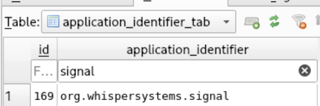

# iForensics - iBackdoor 1&#47;2

## Challenge

You continue your analysis to find the backdoor on the phone. Eventually, you realize that an application has been compromised and that the phone was infected at the time of collection. Find the identifier of the compromised application and the process identifier (PID) of the malware.

The flag is in the format `FCSC{<application identifier>|<PID>}`. For example, if the compromised application is `Example` (`com.example`) and the PID is 1337: `FCSC{com.example|1337}`.

**Difficulty:** ⭐⭐

[Original challenge on Hackropole](https://hackropole.fr/en/challenges/forensics/fcsc2025-forensics-iforensics-6/).

## Solution

### Load the sysdiagnose archive

From here on, I use the [Sysdiagnose Analysis Framework (SAF)](https://github.com/EC-DIGIT-CSIRC/sysdiagnose). Developed by the European Commission's cybersecurity operations team, it converts Apple sysdiagnose archives into structured data for forensic analysis.

After installing SAF, create a case from the archive and list the available cases:

```sh
λ sysdiag create private/var/mobile/Library/Logs/CrashReporter/DiagnosticLogs/sysdiagnose/sysdiagnose_2025.04.07_08-06-18-0700_iPhone-OS_iPhone_20A362.tar.gz
Case 'C39ZL6V1N6Y6_20250407_150618' created successfully from 'private/var/mobile/Library/Logs/CrashReporter/DiagnosticLogs/sysdiagnose/sysdiagnose_2025.04.07_08-06-18-0700_iPhone-OS_iPhone_20A362.tar.gz'

λ sysdiag cases
#### case List ####
Case ID                       acquisition date                  Serial number    Unique device ID             iOS Version  Tags
----------------------------  --------------------------------  ---------------  -------------------------  -------------  ------
C39ZL6V1N6Y6_20250407_150618  2025-04-07T15:06:18.000000+00:00  C39ZL6V1N6Y6     00008030-000E11000A84802E             16
```

The case ID is `C39ZL6V1N6Y6_20250407_150618`.

### Inspect the process list

This sysdiagnose archive includes a snapshot of running processes in `ps.txt`. It provides a process list, similar in purpose to the output of Volatility's `windows.pslist`, without requiring a memory image.

```text
cases/C39ZL6V1N6Y6_20250407_150618/data/sysdiagnose_2025.04.07_08-06-18-0700_iPhone-OS_iPhone_20A362/ps.txt
```

```text
USER               UID PRSNA   PID  PPID        F  %CPU %MEM PRI NI      VSZ    RSS WCHAN    TT  STAT STARTED      TIME COMMAND
root                 0     -     1     0     4004   0.0  0.0   0  0        0      0 -        ??  ?s    7:47AM   0:00.00 /sbin/launchd
root                 0   200    29     1  4004004   0.0  0.0   0  0        0      0 -        ??  ?s    7:47AM   0:00.00 /usr/libexec/UserEventAgent (System)
_logd              272   199    30     1  4004004   0.0  0.0   0  0        0      0 -        ??  ?s    7:47AM   0:00.00 /usr/libexec/logd
root                 0   200    31     1  4004004   0.0  0.0   0  0        0      0 -        ??  ?s    7:47AM   0:00.00 /usr/libexec/runningboardd
mobile             501   200    32     1  4004004   0.0  0.0   0  0        0      0 -        ??  ?s    7:47AM   0:00.00 /System/Library/CoreServices/SpringBoard.app/SpringBoard
mobile             501   200    33     1  4004004   0.0  0.0   0  0        0      0 -        ??  ?s    7:47AM   0:00.00 /System/Library/PrivateFrameworks/People.framework/peopled
mobile             501   200    34     1  4004004   0.0  0.0   0  0        0      0 -        ??  ?s    7:47AM   0:00.00 /usr/sbin/mediaserverd
...<SNIP>...
```

The entries for Signal stand out:

```text
USER               UID PRSNA   PID  PPID        F  %CPU %MEM PRI NI      VSZ    RSS WCHAN    TT  STAT STARTED      TIME COMMAND
root                 0    99   279     1  4004004   0.0  0.0   0  0        0      0 -        ??  ?     7:47AM   0:00.00 /var/containers/Bundle/Application/4B6E715E-641B-4F43-B39B-CA9AE3E8B73B/Signal.app/mussel dGNwOi8vOTguNjYuMTU0LjIzNToyOTU1Mg==
root                 0    99   330     1  4004004   0.0  0.0   0  0        0      0 -        ??  ?     7:47AM   0:00.00 /var/containers/Bundle/Application/4B6E715E-641B-4F43-B39B-CA9AE3E8B73B/Signal.app/mussel dGNwOi8vOTguNjYuMTU0LjIzNToyOTU1Mg==
mobile             501  1000   344     1  4004044   0.0  0.0   0  0        0      0 -        ??  ?s    7:56AM   0:00.00 /var/containers/Bundle/Application/4B6E715E-641B-4F43-B39B-CA9AE3E8B73B/Signal.app/Signal
root                 0    99   345   344  4004004   0.0  0.0   0  0        0      0 -        ??  ?     7:56AM   0:00.00 /var/containers/Bundle/Application/4B6E715E-641B-4F43-B39B-CA9AE3E8B73B/Signal.app/mussel dGNwOi8vOTguNjYuMTU0LjIzNToyOTU1Mg==
```

Inside `Signal.app`, an executable named `mussel` takes a Base64-encoded argument. Decoding it reveals a TCP endpoint:

```sh
λ cat ps_processed.txt | grep -i "Signal.app"
2025-04-07T08:06:18.000000-07:00        279     /var/containers/Bundle/Application/4B6E715E-641B-4F43-B39B-CA9AE3E8B73B/Signal.app/mussel dGNwOi8vOTguNjYuMTU0LjIzNToyOTU1Mg==
2025-04-07T08:06:18.000000-07:00        330     /var/containers/Bundle/Application/4B6E715E-641B-4F43-B39B-CA9AE3E8B73B/Signal.app/mussel dGNwOi8vOTguNjYuMTU0LjIzNToyOTU1Mg==
2025-04-07T08:06:18.000000-07:00        344     /var/containers/Bundle/Application/4B6E715E-641B-4F43-B39B-CA9AE3E8B73B/Signal.app/Signal
2025-04-07T08:06:18.000000-07:00        345     /var/containers/Bundle/Application/4B6E715E-641B-4F43-B39B-CA9AE3E8B73B/Signal.app/mussel dGNwOi8vOTguNjYuMTU0LjIzNToyOTU1Mg==

λ echo "dGNwOi8vOTguNjYuMTU0LjIzNToyOTU1Mg==" | base64 -d
tcp://98.66.154.235:29552
```

### Identify the application and PID

The compromised application is `Signal.app`. Its bundle identifier, `org.whispersystems.signal`, appears in:

```text
private/var/mobile/Library/FrontBoard/applicationState.db
```

[](../../../assets/fcsc/2025/ibackdoor-1-signal-bundle-id.png)

The process list shows three `mussel` PIDs: `279`, `330`, and `345`. PID `344` belongs to Signal, and the `PPID` column identifies it as the parent of PID `345`.

```text
FCSC{org.whispersystems.signal|344}
```
