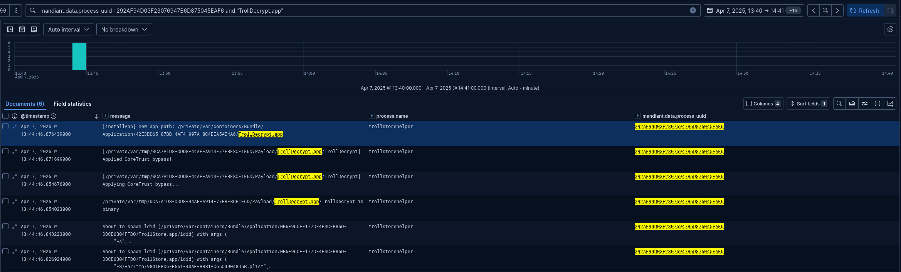
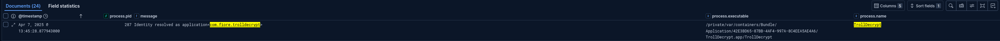
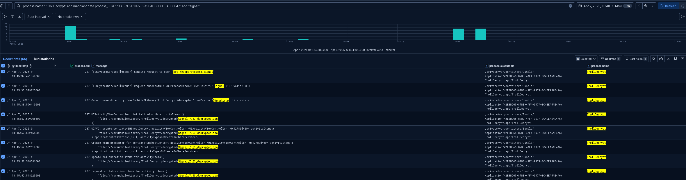

# iForensics - iBackdoor 2&#47;2

## Challenge

Now that you know which application has been compromised, find out how the attacker retrieved the legitimate application before infection.

Find:

- The identifier of the application used to retrieve the legitimate application.
- The path used to store the legitimate application.
- The date when the legitimate application was uninstalled, in local time.

The flag is in the format `FCSC{<application identifier>|<path>|<date>}`. For example, if the application used is `Example` (`com.example`), the path is `/private/var/tmp/test.xyz`, and the uninstall date is `2025-01-01 01:00:00`: `FCSC{com.example|/private/var/tmp/test.xyz|2025-01-01 01:00:00}`.

**Difficulty:** ⭐⭐

[Original challenge on Hackropole](https://hackropole.fr/en/challenges/forensics/fcsc2025-forensics-iforensics-7/).

## Solution

*This write-up follows my investigation, including the detours. A direct route to the flag would lose some of the reasoning.*

At first, the question puzzled me: why would an attacker retrieve a legitimate application? I started with a few places to look.

SAF can parse `system_logs.logarchive` into `logarchive.jsonl` under the case's `parsed_data` directory. On Linux, it uses Mandiant's UnifiedLogs parser, as described in the [SAF documentation](https://github.com/EC-DIGIT-CSIRC/sysdiagnose#unifiedlogs).

From [iBackdoor 1](ibackdoor-1.md), we know the backdoor executable is:

```text
/var/containers/Bundle/Application/4B6E715E-641B-4F43-B39B-CA9AE3E8B73B/Signal.app/mussel
```

### Establish the installation timeline

Application installation and removal events appear in:

```text
/private/var/installd/Library/Logs/MobileInstallation/mobile_installation.log.*
```

I found these logs in the sysdiagnose collection rather than the backup, under:

```text
cases/C39ZL6V1N6Y6_20250407_150618/data/sysdiagnose_2025.04.07_08-06-18-0700_iPhone-OS_iPhone_20A362/logs/MobileInstallation
```

From that directory, search for Signal's bundle identifier:

```sh
λ cat * | grep -i "org.whispersystems.signal"
Mon Apr  7 06:13:34 2025 [234] <notice> (0x16b48f000) -[MIInstaller _installInstallable:containingSymlink:error:]: Installing <MIInstallableBundle ID=org.whispersystems.signal; Version=(null), ShortVersion=(null)>
Mon Apr  7 06:13:34 2025 [234] <notice> (0x16b48f000) -[MIContainer makeContainerLiveReplacingContainer:reason:waitForDeletion:withError:]: Made container live for org.whispersystems.signal at /private/var/mobile/Containers/Data/Application/7D8F45EA-CF9E-4074-910B-33CE7A8E196B
Mon Apr  7 06:13:34 2025 [234] <notice> (0x16b48f000) -[MIContainer makeContainerLiveReplacingContainer:reason:waitForDeletion:withError:]: Made container live for org.whispersystems.signal at /private/var/containers/Bundle/Application/9FE717E1-1A80-4973-B315-158AF5E4311E
Mon Apr  7 06:13:34 2025 [234] <err> (0x16b48f000) -[MIInstaller _onRegistrationQueue_registerInstalledInfo:error:]: Successfully registered [org.whispersystems.signal/PersonalPersonaPlaceholderString] for 501
Mon Apr  7 06:13:34 2025 [234] <notice> (0x16b48f000) -[MIInstaller performInstallationWithError:]: Install Successful for (Placeholder:org.whispersystems.signal); Staging: 0.01s; Waiting: 0.00s; Preflight/Patch: 0.00s, Verifying: 0.01s; Overall: 0.14s
Mon Apr  7 06:13:34 2025 [234] <notice> (0x16b48f000) -[MIClientConnection updatePlaceholderMetadataForApp:installType:failureReason:underlyingError:failureSource:completion:]: Update placeholder metadata requested by client installcoordinationd (pid 960 (501/501)) for app org.whispersystems.signal installType = 1 failureReason = 0 underlyingError = (null) failureSource = 0
Mon Apr  7 06:13:50 2025 [234] <notice> (0x16b48f000) -[MIInstaller _installInstallable:containingSymlink:error:]: Installing <MIInstallableBundle ID=org.whispersystems.signal; Version=703, ShortVersion=7.53>
Mon Apr  7 06:13:51 2025 [234] <notice> (0x16b48f000) -[MIInstallableBundle _validateApplicationIdentifierForNewBundleSigningInfo:error:]: Allowing update to app org.whispersystems.signal even though the older version does not have the application-identifier entitlement.
Mon Apr  7 06:13:52 2025 [234] <notice> (0x16b48f000) -[MIInstallableBundle _refreshUUIDForContainer:withError:]: Data container for org.whispersystems.signal is now at /private/var/mobile/Containers/Data/Application/99FCC994-C7C1-4F60-A797-0BFFB204453A
Mon Apr  7 06:13:52 2025 [234] <notice> (0x16b48f000) -[MIContainer makeContainerLiveReplacingContainer:reason:waitForDeletion:withError:]: Made container live for org.whispersystems.signal.shareextension at /private/var/mobile/Containers/Data/PluginKitPlugin/A9321276-4AF9-4BE5-8041-E399CA137541
Mon Apr  7 06:13:52 2025 [234] <notice> (0x16b48f000) -[MIContainer makeContainerLiveReplacingContainer:reason:waitForDeletion:withError:]: Made container live for org.whispersystems.signal.SignalNSE at /private/var/mobile/Containers/Data/PluginKitPlugin/30C28DF1-55B5-4F5D-8FAC-B9A1E8700E7D
Mon Apr  7 06:13:52 2025 [234] <notice> (0x16b48f000) -[MIContainer makeContainerLiveReplacingContainer:reason:waitForDeletion:withError:]: Made container live for org.whispersystems.signal at /private/var/containers/Bundle/Application/1EC20F02-263B-4299-AE05-3F5D7A7744E9
Mon Apr  7 06:13:52 2025 [234] <err> (0x16b48f000) -[MIInstaller _onRegistrationQueue_registerInstalledInfo:error:]: Successfully registered [org.whispersystems.signal/PersonalPersonaPlaceholderString] for 501
Mon Apr  7 06:13:52 2025 [234] <notice> (0x16b48f000) -[MIInstaller performInstallationWithError:]: Install Successful for (Customer:org.whispersystems.signal); Staging: 0.03s; Waiting: 0.00s; Preflight/Patch: 0.06s, Verifying: 1.03s; Overall: 1.27s
...<SNIP>...
Mon Apr  7 07:40:47 2025 [446] <notice> (0x16fc9b000) -[MIUninstaller _uninstallBundleWithIdentity:linkedToChildren:waitForDeletion:uninstallReason:temporaryReference:wasLastReference:error:]: Uninstalling identifier org.whispersystems.signal
Mon Apr  7 07:40:47 2025 [446] <err> (0x16fc9b000) -[MIUninstaller _uninstallBundleWithIdentity:linkedToChildren:waitForDeletion:uninstallReason:temporaryReference:wasLastReference:error:]: Destroying container org.whispersystems.signal with persona (null) at /private/var/containers/Bundle/Application/1EC20F02-263B-4299-AE05-3F5D7A7744E9
Mon Apr  7 07:40:47 2025 [446] <err> (0x16fc9b000) -[MIUninstaller _uninstallBundleWithIdentity:linkedToChildren:waitForDeletion:uninstallReason:temporaryReference:wasLastReference:error:]: Destroying container org.whispersystems.signal with persona 8A4A857A-0269-4861-BE19-06B76B941887 at /private/var/mobile/Containers/Data/Application/99FCC994-C7C1-4F60-A797-0BFFB204453A
Mon Apr  7 07:40:47 2025 [446] <err> (0x16fc9b000) -[MIUninstaller _uninstallBundleWithIdentity:linkedToChildren:waitForDeletion:uninstallReason:temporaryReference:wasLastReference:error:]: Destroying container org.whispersystems.signal.shareextension with persona 8A4A857A-0269-4861-BE19-06B76B941887 at /private/var/mobile/Containers/Data/PluginKitPlugin/A9321276-4AF9-4BE5-8041-E399CA137541
Mon Apr  7 07:40:47 2025 [446] <err> (0x16fc9b000) -[MIUninstaller _uninstallBundleWithIdentity:linkedToChildren:waitForDeletion:uninstallReason:temporaryReference:wasLastReference:error:]: Destroying container org.whispersystems.signal.SignalNSE with persona 8A4A857A-0269-4861-BE19-06B76B941887 at /private/var/mobile/Containers/Data/PluginKitPlugin/30C28DF1-55B5-4F5D-8FAC-B9A1E8700E7D
...<SNIP>...
```

The [iLEAPP parser](https://github.com/abrignoni/iLEAPP/blob/main/scripts/artifacts/mobileInstall.py) preserves timestamps as written. Its notes explain that the logs contain no timezone marker and that tested samples were consistent with device-local time.

The sysdiagnose filename contains `2025.04.07_08-06-18-0700`, indicating a UTC-7 offset for this collection. I therefore use UTC-7 for these local timestamps.

The installation sequence is:

1. At `06:13:34`, a placeholder for `org.whispersystems.signal` is installed successfully. Its version fields are null, and the success message explicitly identifies it as `Placeholder`.
2. At `06:13:50`, installation of Signal version `7.53`, build `703`, starts. It completes at `06:13:52`.
3. At `07:40:47`, Signal is uninstalled and its application, data, and extension containers are destroyed.

The placeholder initially uses these containers:

- Data: `/private/var/mobile/Containers/Data/Application/7D8F45EA-CF9E-4074-910B-33CE7A8E196B`
- Bundle: `/private/var/containers/Bundle/Application/9FE717E1-1A80-4973-B315-158AF5E4311E`

The full installation uses the following containers, all of which appear again in the removal logs:

- Data: `/private/var/mobile/Containers/Data/Application/99FCC994-C7C1-4F60-A797-0BFFB204453A`
- Bundle: `/private/var/containers/Bundle/Application/1EC20F02-263B-4299-AE05-3F5D7A7744E9`
- Share extension: `/private/var/mobile/Containers/Data/PluginKitPlugin/A9321276-4AF9-4BE5-8041-E399CA137541`
- Notification extension: `/private/var/mobile/Containers/Data/PluginKitPlugin/30C28DF1-55B5-4F5D-8FAC-B9A1E8700E7D`

For comparison with the UTC timestamps in the unified logs:

| Event | Local time (UTC-7) | UTC |
| --- | --- | --- |
| Installation starts | 2025-04-07 06:13:50 | 2025-04-07 13:13:50 |
| Installation completes | 2025-04-07 06:13:52 | 2025-04-07 13:13:52 |
| Uninstallation | 2025-04-07 07:40:47 | 2025-04-07 14:40:47 |

### Follow TrollDecrypt and TrollStore

With 945,146 entries to examine, broad searches for `Signal.app` and `signal` were unwieldy. These timestamps help narrow the search. Two applications stand out during this window and just after the uninstallation:

```sh
2025-04-07T13:45:38.596410+00:00        287     /private/var/containers/Bundle/Application/42E3BD65-87BB-4AF4-997A-8C4EEA5AE4A6/TrollDecrypt.app/TrollDecrypt   Cannot make directory /var/mobile/Library/TrollDecrypt/decrypted/ipa/Payload/Signal.app: File exists

2025-04-07T14:41:21.310262+00:00        454     /private/var/containers/Bundle/Application/0B6E96CE-177D-4E4C-B85D-DDCE6B04FFD0/TrollStore.app/trollstorehelper About to spawn ldid (/private/var/containers/Bundle/Application/0B6E96CE-177D-4E4C-B85D-DDCE6B04FFD0/TrollStore.app/ldid) with args (\n    "-S/var/tmp/F6B04647-333F-4CAC-ADE2-9AF2E495E244.plist",\n    "/private/var/tmp/CC0D2159-AF86-497E-8D10-1491B167F3C1/Payload/Signal.app/PlugIns/SignalShareExtension.appex/SignalShareExtension"\n)
```

At `2025-04-07 13:45:38 UTC`, `TrollDecrypt.app` tries to create `/var/mobile/Library/TrollDecrypt/decrypted/ipa/Payload/Signal.app`, but the directory already exists.

[TrollDecrypt](https://github.com/donato-fiore/TrollDecrypt) decrypts installed iOS applications into IPA archives. [TrollStore](https://github.com/opa334/TrollStore) uses a CoreTrust verification flaw to install applications persistently on supported iOS versions without periodic re-signing. This suggests how a legitimate app could be extracted, modified, and installed again.

An IPA is a ZIP archive containing an iOS application bundle under `Payload/`. Apple's [instructions for inspecting an IPA](https://developer.apple.com/library/archive/qa/qa1798/_index.html) show this layout.

Working backward in the logs confirms that TrollStore installed TrollDecrypt:

Filtering on the `PROCESS_UUID` associated with `trollstorehelper` makes the sequence easier to follow:

[](../../../assets/fcsc/2025/ibackdoor-2-trolldecrypt-installation.png)

This confirms the installation and gives us another useful search string: `[installApp] new app path:`.

The following entries identify the application as `com.fiore.trolldecrypt`:

[](../../../assets/fcsc/2025/ibackdoor-2-trolldecrypt-bundle-id.png)

Following TrollDecrypt in the same way gives the `PROCESS_UUID` `9BF97D2D1D773949B4C68B6DBA306F47`:

[](../../../assets/fcsc/2025/ibackdoor-2-signal-extraction.png)

### Recover the exported IPA path

The evidence points to TrollDecrypt extracting the legitimate Signal application.

```sh
jq -r '
  select(.datetime >= "2025-04-07T13:12:00+00:00"
    and .datetime < "2025-04-07T14:45:00+00:00")
  | (.message // .data.message // "") as $msg
  | select((.data.process // "") | contains("TrollDecrypt"))
  | [.datetime, .data.pid, .data.process, $msg]
  | @tsv
' logarchive.jsonl > trolldecrypt-logarchive.txt
```

TrollDecrypt requests that Signal be opened:

```text
2025-04-07T13:45:37.471350+00:00        287     /private/var/containers/Bundle/Application/42E3BD65-87BB-4AF4-997A-8C4EEA5AE4A6/TrollDecrypt.app/TrollDecrypt   [FBSSystemService][0xe8d7] Sending request to open "org.whispersystems.signal"
```

The request succeeds. Although the directory creation message initially confused me, the next entries identify an IPA presented to the share sheet:

```text
2025-04-07T13:45:37.579825+00:00        287     /private/var/containers/Bundle/Application/42E3BD65-87BB-4AF4-997A-8C4EEA5AE4A6/TrollDecrypt.app/TrollDecrypt   [FBSSystemService][0xe8d7] Request successful: <BSProcessHandle: 0x281d5f0f0; Signal:316; valid: YES>
2025-04-07T13:45:38.596410+00:00        287     /private/var/containers/Bundle/Application/42E3BD65-87BB-4AF4-997A-8C4EEA5AE4A6/TrollDecrypt.app/TrollDecrypt   Cannot make directory /var/mobile/Library/TrollDecrypt/decrypted/ipa/Payload/Signal.app: File exists
2025-04-07T13:45:52.529066+00:00        287     /private/var/containers/Bundle/Application/42E3BD65-87BB-4AF4-997A-8C4EEA5AE4A6/TrollDecrypt.app/TrollDecrypt   UIActivityViewController: initialized with activityItems ((\n    "file:///var/mobile/Library/TrollDecrypt/decrypted/Signal_7.53_decrypted.ipa"\n))
```

At `2025-04-07 14:20:37.132369+00:00`, TrollDecrypt appears again as PID `403`, with similar activity around the IPA. I could not determine why it repeated, and this was not needed to recover the flag.

The logs use `/var/mobile/...`; the filesystem listing below records the requested `/private/var/mobile/...` path. Combined with the local uninstallation time, this gives:

```text
FCSC{com.fiore.trolldecrypt|/private/var/mobile/Library/TrollDecrypt/decrypted/Signal_7.53_decrypted.ipa|2025-04-07 07:40:47}
```

### Alternative: inspect the filesystem listing

Other write-ups pointed to a filesystem listing that records paths and metadata at collection time. In this dataset, it is inside a compressed archive under `private/var/mobile/Library/Logs/CrashReporter/`:

```sh
λ file FilesystemMeta-2025-04-07-080524.fsmeta.tgz
FilesystemMeta-2025-04-07-080524.fsmeta.tgz: gzip compressed data, last modified: Mon Apr  7 15:06:08 2025, from Unix, original size modulo 2^32 47214080
```

The archive contains filesystem metadata and `.fslisting` files.

Create the destination directory, then extract the archive without removing the original:

```sh
λ mkdir -p FilesystemMeta-2025-04-07-080524
λ tar -xzf FilesystemMeta-2025-04-07-080524.fsmeta.tgz -C FilesystemMeta-2025-04-07-080524
```

The extracted directory contains:

```sh
λ ls -lah FilesystemMeta-2025-04-07-080524
total 12K
drwxrwxr-x  3 fx5 fx5 4.0K Sep 18 23:36 .
drwxr-xr-x 10 fx5 fx5 4.0K Sep 18 23:36 ..
drwxr-xr-x  2 fx5 fx5 4.0K Apr  7  2025 FilesystemMeta-2025-04-07-080524.fsmeta

λ ls -lah FilesystemMeta-2025-04-07-080524/FilesystemMeta-2025-04-07-080524.fsmeta/
total 46M
drwxr-xr-x 2 fx5 fx5 4.0K Apr  7  2025 .
drwxrwxr-x 3 fx5 fx5 4.0K Sep 18 23:36 ..
-rw-r--r-- 1 fx5 fx5 5.5K Apr  7  2025 11522918680704473124.fslisting
-rw-r--r-- 1 fx5 fx5  433 Apr  7  2025 2202750465231067252.fslisting
-rw-r--r-- 1 fx5 fx5  40M Apr  7  2025 4143862369472490735.fslisting
-rw-r--r-- 1 fx5 fx5 5.3K Apr  7  2025 8712524316630837614.fslisting
-rw-r--r-- 1 fx5 fx5  431 Apr  7  2025 dev-devfs.fslisting
-rw-r--r-- 1 fx5 fx5 4.6K Apr  7  2025 log.log
-rw-r--r-- 1 fx5 fx5 104K Apr  7  2025 metadata.plist
-rw-r--r-- 1 fx5 fx5 483K Apr  7  2025 private_preboot-dev_disk1s6.fslisting
-rw-r--r-- 1 fx5 fx5 5.2M Apr  7  2025 private_var-dev_disk1s2.fslisting
-rw-r--r-- 1 fx5 fx5  14K Apr  7  2025 private_var_hardware-dev_disk1s5.fslisting
-rw-r--r-- 1 fx5 fx5  32K Apr  7  2025 private_var_MobileSoftwareUpdate-dev_disk1s7.fslisting
-rw-r--r-- 1 fx5 fx5  851 Apr  7  2025 private_var_wireless_baseband_data-dev_disk1s4.fslisting
-rw-r--r-- 1 fx5 fx5  495 Apr  7  2025 private_xarts-dev_disk1s3.fslisting
-rw-r--r-- 1 fx5 fx5  291 Apr  7  2025 README.txt
```

Open the listing from inside the extracted `FilesystemMeta-2025-04-07-080524.fsmeta` directory:

```sh
less private_var-dev_disk1s2.fslisting
```

A broad search still returns 845 matches. The answer does not quite appear by magic:

```console
$ grep -iR "signal" . | wc -l
845

# Search the filesystem listing
$ grep -iR "signal" private_var-dev_disk1s2.fslisting 

# Show the column headers
cat private_var-dev_disk1s2.fslisting | head
Version:        49
Hashed: NO
Total:  255881465856
Used:   4273438720
Free:   243443892224
------------------------------------------------------------------------------------------------
Size-On-Disk    File-Size       Compression     FS-Purgeable-Flags      mtime   Mode    UID     GID     Path
------------------------------------------------------------------------------------------------
<BEGIN>

# Matching entry
66605056        66603101        -       0       1744033541      33188   501     501     /private/var/mobile/Library/TrollDecrypt/decrypted/Signal_7.53_decrypted.ipa
```

This entry confirms the full path to `Signal_7.53_decrypted.ipa`.
