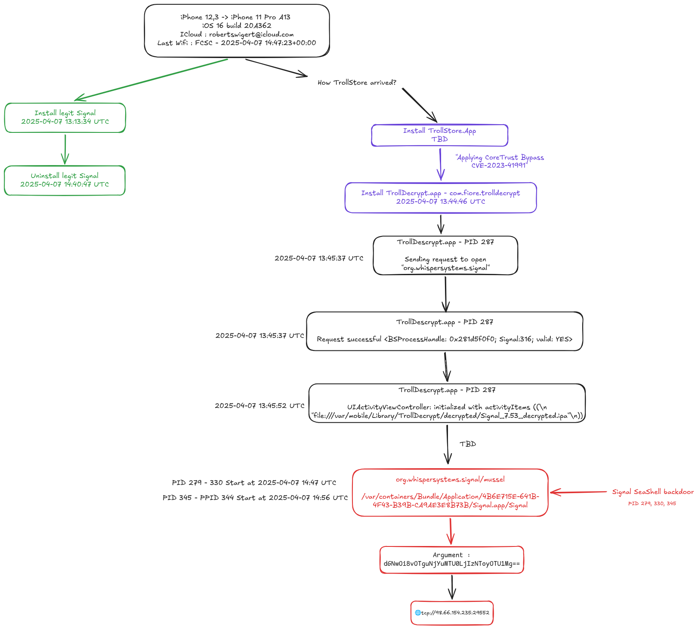
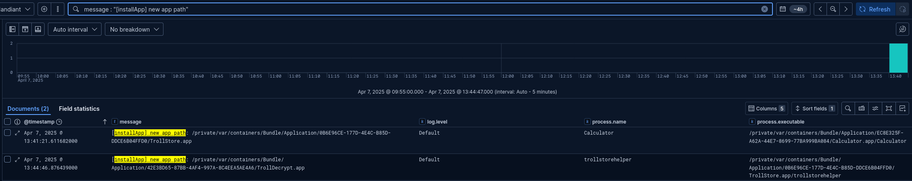
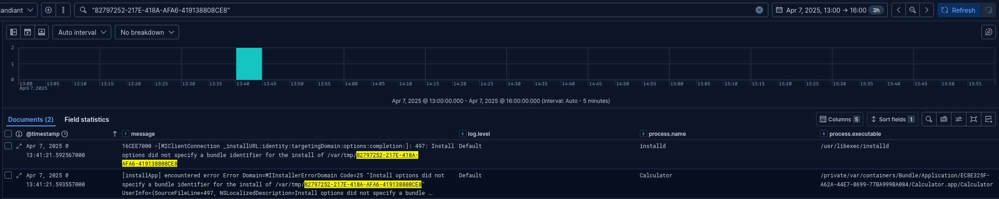
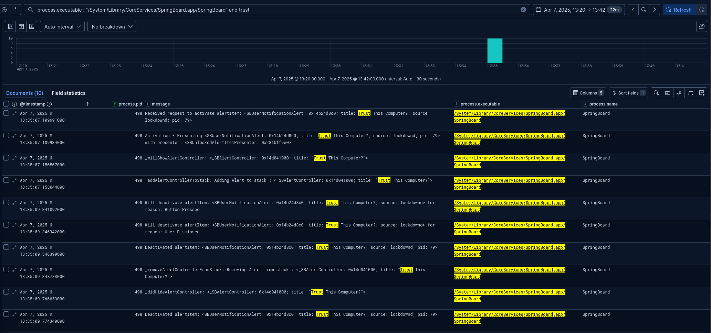
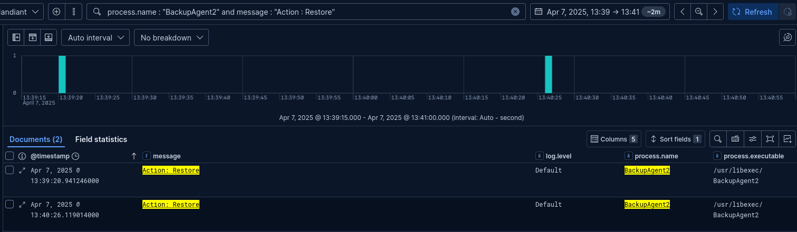
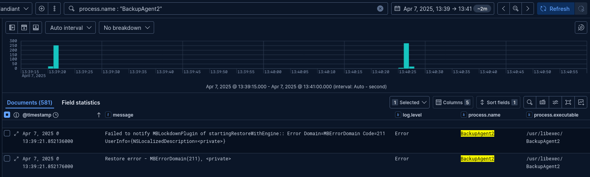
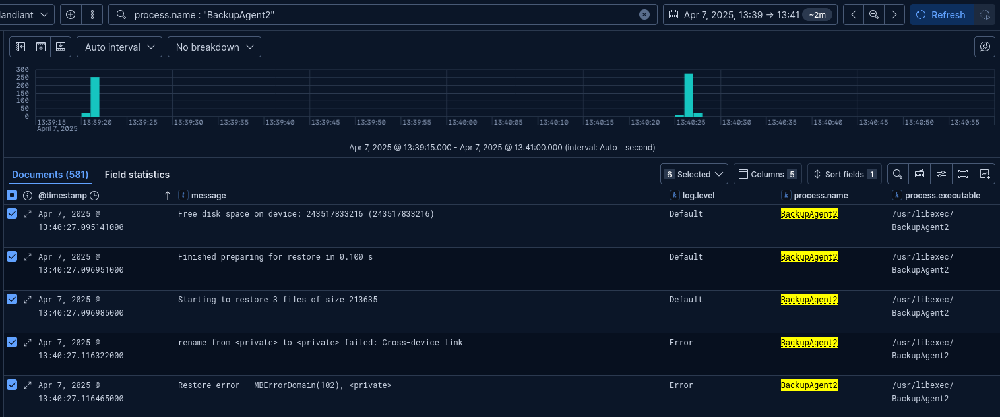
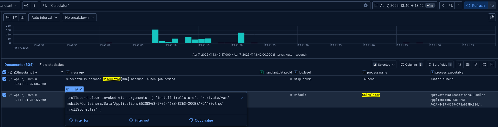

# iForensics - iCompromise

## Challenge

To conclude the investigation, identify the initial infection vector:

- The exploited vulnerability, as a CVE identifier.
- The initial infection time in UTC, without seconds.

The flag format is `FCSC{<CVE identifier>|<infection date>}`. For example, a compromise using `CVE-2025-00001` at `2025-01-01 01:00` UTC would give `FCSC{CVE-2025-00001|2025-01-01 01:00}`.

**Difficulty:** ⭐⭐⭐

[Official challenge on Hackropole](https://hackropole.fr/en/challenges/forensics/fcsc2025-forensics-iforensics-9/)

## Solution

This is where things get complicated. At this point, I have:

- The device configuration.
- A few message exchanges.
- The backdoor and its installation chain.

I map what I know before digging further:

[](../../../assets/fcsc/2025/icompromise-investigation-diagram.png)

*`TrollDescrypt` means `TrollDecrypt`.*

My first hypothesis is that the infection time matches the installation of TrollStore, which later enabled the backdoor installation. The initial compromise may have happened earlier, so I still need to trace how TrollStore arrived.

### How was TrollStore installed?

TrollStore uses a CoreTrust signature-validation bypass, but it needs its own installation method. The [ChOma library](https://github.com/opa334/ChOma), maintained by TrollStore developer opa334, handles Mach-O files and their CMS signature blobs. It implements the CoreTrust bypass for `CVE-2023-41991` used by TrollStore.

The device details from the earlier challenges matter again:

- iPhone 11 Pro with an A13 chip.
- iOS 16.0, build `20A362`.

I consider two compatible installation routes: [TrollInstallerX](https://github.com/alfiecg24/TrollInstallerX) and [TrollRestore](https://github.com/JJTech0130/TrollRestore). These are candidates, not an exhaustive list of installation methods.

#### TrollInstallerX

TrollInstallerX can be sideloaded as an IPA, then opened to install TrollStore. The workflow I examine uses [PlumeImpactor](https://github.com/khcrysalis/PlumeImpactor), which signs and sideloads apps using an Apple Account. On Windows, it also requires iTunes drivers. PlumeImpactor supports AppSync and IPAs obtained with ipatool.

The relevant steps are:

1. Connect the iPhone to a computer and accept the trust prompt.
2. Open PlumeImpactor and sign in under **Settings > Sign In**.
3. Drag in the TrollInstallerX IPA and install it.
4. Open TrollInstallerX on the phone and start the TrollStore installation.

The Apple Account requirement initially makes this route seem less likely. However, sideloading does not necessarily require the victim's account, so this alone cannot rule it out.

#### TrollRestore

TrollRestore supports the device's iOS version. The project provides packaged releases for supported desktop platforms.

[TrollRestore's README](https://github.com/JJTech0130/TrollRestore) explains that it replaces a removable system app's executable with TrollHelper through a crafted backup. This uses `CVE-2024-44252`, a MobileBackup issue that can modify protected system files during a restore. [Apple's security advisory](https://support.apple.com/en-us/121563) confirms the CVE and its impact.

On Linux, after setting up the tool:

1. Connect the iPhone to a trusted computer.
2. Run `python3 trollstore.py`.
3. Select a removable system app to overwrite, such as Tips.
4. After the device restarts, open that app to install TrollStore.

The key distinction is the replacement of an existing app's executable. The [script](https://github.com/JJTech0130/TrollRestore/blob/main/trollstore.py) restores the helper, then explicitly restarts the device. This route looks plausible.

### Finding the TrollStore installation

I search for the installation of `TrollStore.app`, as I did for `TrollDecrypt.app`, to identify the process responsible. TrollDecrypt was installed at `2025-04-07 13:44:46` UTC. Using this as an upper bound reduces the dataset from over 4 million entries to roughly 1.5 million.

[](../../../assets/fcsc/2025/icompromise-trollstore-installation.png)
```json
{
  "datetime": "2025-04-07T13:41:21.611682+00:00",
  "message": "[installApp] new app path: /private/var/containers/Bundle/Application/0B6E96CE-177D-4E4C-B85D-DDCE6B04FFD0/TrollStore.app",
  "timestamp_desc": "logarchive",
  "module": "logarchive",
  "data": {
    "subsystem": "",
    "thread_id": 4782,
    "pid": 342,
    "euid": 0,
    "library": "/private/var/containers/Bundle/Application/EC8E325F-A62A-44E7-8699-77BA999BA084/Calculator.app/Calculator",
    "library_uuid": "E3CA9B2066C43673BFBF5471E09968F8",
    "activity_id": 0,
    "parent_activity_id": 0,
    "time": 1.7440332816116823E+18,
    "category": "",
    "event_type": "Log",
    "log_type": "Default",
    "process": "/private/var/containers/Bundle/Application/EC8E325F-A62A-44E7-8699-77BA999BA084/Calculator.app/Calculator",
    "process_uuid": "E3CA9B2066C43673BFBF5471E09968F8",
    "message": "[installApp] new app path: /private/var/containers/Bundle/Application/0B6E96CE-177D-4E4C-B85D-DDCE6B04FFD0/TrollStore.app",
    "raw_message": "[installApp] new app path: %@",
    "boot_uuid": "9B490BD953AF4EFFA953CBB28A590182",
    "timezone_name": "Pacific",
    "message_entries": [
      {
        "item_type": 64,
        "item_type_size": 4,
        "offset": 0,
        "item_size": 95,
        "message_strings": "/private/var/containers/Bundle/Application/0B6E96CE-177D-4E4C-B85D-DDCE6B04FFD0/TrollStore.app",
        "item": "String"
      }
    ],

    "timestamp": 1744033281.611682,
    "message_flags": [
      "MainExe"
    ],
    "evidence": "./cases/C39ZL6V1N6Y6_20250407_150618/data/sysdiagnose_2025.04.07_08-06-18-0700_iPhone-OS_iPhone_20A362/system_logs.logarchive/Persist/000000000000000a.tracev3",
    "datetime": "2025-04-07T13:41:21.611682+00:00"
  }
}
```

`TrollStore.app` is installed by `Calculator.app`, with PID `342`, `process_uuid: E3CA9B2066C43673BFBF5471E09968F8`, and effective UID `0`. A calculator installing apps as root deserves a closer look.

This strengthens the TrollRestore hypothesis...

Filtering on the executable UUID returns 887 entries, including 572 before TrollStore's installation. I also compare the bundle-container UUID in the log with the one recorded in `private/var/mobile/Library/FrontBoard/applicationState.db`:
```
Bundle ID : com.apple.calculator
Bundle Path : /private/var/containers/Bundle/Application/E3C72607-1825-435A-ADED-D6F0BFBC0785/Calculator.app
SandboxPath : /private/var/mobile/Containers/Data/Application/98BD38F2-0EEC-46FF-88BB-ACF5EDB3283D
```

The container UUIDs differ. I search `mobile_installation.log` for the older Calculator container, `EC8E325F-A62A-44E7-8699-77BA999BA084`:
```sh
λ cat mobile_installation.log.0 mobile_installation.log.1 | grep -i "EC8E325F-A62A-44E7-8699-77BA999BA084"
Mon Apr  7 07:45:14 2025 [446] <err> (0x16fc9b000) -[MIUninstaller _uninstallBundleWithIdentity:linkedToChildren:waitForDeletion:uninstallReason:temporaryReference:wasLastReference:error:]: Destroying container com.apple.calculator with persona (null) at /private/var/containers/Bundle/Application/EC8E325F-A62A-44E7-8699-77BA999BA084
Mon Apr  7 06:03:01 2025 [234] <notice> (0x16b5a7000) -[MIContainer makeContainerLiveReplacingContainer:reason:waitForDeletion:withError:]: Made container live for com.apple.calculator at /private/var/containers/Bundle/Application/EC8E325F-A62A-44E7-8699-77BA999BA084
```

The old container became live at `2025-04-07 13:03:01` UTC and was removed at `14:45:14`. Searching the surrounding logs also finds several reboot-detection entries. The combined files are not in chronological order:

```text
Mon Apr  7 06:41:21 2025 [343] <notice> (0x211a06380) main: Reboot detected
Mon Apr  7 07:40:47 2025 [446] <notice> (0x23105a380) main: Reboot detected
Mon Apr  7 08:03:33 2025 [387] <notice> (0x21e7c6380) main: Reboot detected
Mon Apr  7 02:56:37 2025 [234] <notice> (0x2174a6380) main: Reboot detected
```

These correspond to `13:41:21`, `14:40:47`, `15:03:33`, and `09:56:37` UTC. The first detection coincides with the TrollStore installation event. It records when the service detected a reboot, not necessarily the exact restart time. 

Another detection follows about an hour later:
```
Mon Apr  7 06:41:21 2025 [343] <notice> (0x211a06380) main: Reboot detected
Mon Apr  7 06:41:21 2025 [343] <notice> (0x211a06380) MIIsBuildUpgrade: Current build version (20A362 / (null)) equal to last version recorded (20A362 / (null)); skipping upgrade
Mon Apr  7 06:41:21 2025 [343] <err> (0x211a06380) -[MIDiskImageManager _initializeMountInfoFromStorage]: Failed to read /var/installd/Library/MobileInstallation/DiskImageMountPaths.plist : Error Domain=NSCocoaErrorDomain Code=260 "The file “DiskImageMountPaths.plist” couldn’t be opened because there is no such file." UserInfo={NSFilePath=/var/installd/Library/MobileInstallation/DiskImageMountPaths.plist, NSUnderlyingError=0x119d06940 {Error Domain=NSPOSIXErrorDomain Code=2 "No such file or directory"}}
Mon Apr  7 06:41:21 2025 [343] <err> (0x16cee7000) -[MIClientConnection _installURL:identity:targetingDomain:options:completion:]: 497: Install options did not specify a bundle identifier for the install of /var/tmp/82797252-217E-418A-AFA6-419138808CE8
Mon Apr  7 07:40:47 2025 [446] <notice> (0x23105a380) main: Reboot detected
```

Out of curiosity, I search for `82797252-217E-418A-AFA6-419138808CE8`, the temporary path in the installation warning. Calculator appears again:

[](../../../assets/fcsc/2025/icompromise-calculator-install-error.png)

After the later reboot-detection entry at `14:40:47` UTC, the events look like cleanup:

```text
Mon Apr  7 07:40:47 2025 [446] <notice> (0x23105a380) main: Reboot detected

# Uninstalling the legitimate Signal app
Mon Apr  7 07:40:47 2025 [446] <notice> (0x16fc9b000) -[MIUninstaller _uninstallBundleWithIdentity:linkedToChildren:waitForDeletion:uninstallReason:temporaryReference:wasLastReference:error:]: Uninstalling identifier org.whispersystems.signal
Mon Apr  7 07:40:47 2025 [446] <err> (0x16fc9b000) -[MIUninstaller _uninstallBundleWithIdentity:linkedToChildren:waitForDeletion:uninstallReason:temporaryReference:wasLastReference:error:]: Destroying container org.whispersystems.signal with persona (null) at /private/var/containers/Bundle/Application/1EC20F02-263B-4299-AE05-3F5D7A7744E9
Mon Apr  7 07:40:47 2025 [446] <err> (0x16fc9b000) -[MIUninstaller _uninstallBundleWithIdentity:linkedToChildren:waitForDeletion:uninstallReason:temporaryReference:wasLastReference:error:]: Destroying container org.whispersystems.signal with persona 8A4A857A-0269-4861-BE19-06B76B941887 at /private/var/mobile/Containers/Data/Application/99FCC994-C7C1-4F60-A797-0BFFB204453A
Mon Apr  7 07:40:47 2025 [446] <err> (0x16fc9b000) -[MIUninstaller _uninstallBundleWithIdentity:linkedToChildren:waitForDeletion:uninstallReason:temporaryReference:wasLastReference:error:]: Destroying container org.whispersystems.signal.shareextension with persona 8A4A857A-0269-4861-BE19-06B76B941887 at /private/var/mobile/Containers/Data/PluginKitPlugin/A9321276-4AF9-4BE5-8041-E399CA137541
Mon Apr  7 07:40:47 2025 [446] <err> (0x16fc9b000) -[MIUninstaller _uninstallBundleWithIdentity:linkedToChildren:waitForDeletion:uninstallReason:temporaryReference:wasLastReference:error:]: Destroying container org.whispersystems.signal.SignalNSE with persona 8A4A857A-0269-4861-BE19-06B76B941887 at /private/var/mobile/Containers/Data/PluginKitPlugin/30C28DF1-55B5-4F5D-8FAC-B9A1E8700E7D
Mon Apr  7 07:40:47 2025 [446] <err> (0x16fc9b000) -[MIUninstaller _onRegistrationQueue_registerUninstallationForRemovedInfo:error:]: Successfully unregistered <MIUninstallRecord: 0x104e1f200> for 501

# Uninstalling TrollDecrypt
Mon Apr  7 07:43:55 2025 [446] <notice> (0x16fd27000) -[MIClientConnection _uninstallIdentities:withOptions:completion:]: Uninstall requested by lsd (pid 107 (501/501)) for identity [com.fiore.trolldecrypt/PersonalPersonaPlaceholderString] with options: (null)
Mon Apr  7 07:43:55 2025 [446] <err> (0x16fd27000) -[MIUninstaller performUninstallationByRevokingTemporaryReference:error:]: Failed to get children for com.fiore.trolldecrypt : (null); ignoring
Mon Apr  7 07:43:55 2025 [446] <err> (0x16fd27000) -[MIUninstaller performUninstallationByRevokingTemporaryReference:error:]: Failed to get parent of com.fiore.trolldecrypt : (null); ignoring
Mon Apr  7 07:43:55 2025 [446] <err> (0x16fd27000) -[MIUninstaller performUninstallationByRevokingTemporaryReference:error:]: Taking termination assertion on {(
    "com.fiore.trolldecrypt"
)}
Mon Apr  7 07:43:55 2025 [446] <notice> (0x16fd27000) -[MIUninstaller _uninstallBundleWithIdentity:linkedToChildren:waitForDeletion:uninstallReason:temporaryReference:wasLastReference:error:]: Uninstalling identifier com.fiore.trolldecrypt
Mon Apr  7 07:43:55 2025 [446] <err> (0x16fd27000) -[MIUninstaller _uninstallBundleWithIdentity:linkedToChildren:waitForDeletion:uninstallReason:temporaryReference:wasLastReference:error:]: Destroying container com.fiore.trolldecrypt with persona (null) at /private/var/containers/Bundle/Application/42E3BD65-87BB-4AF4-997A-8C4EEA5AE4A6
Mon Apr  7 07:43:55 2025 [446] <err> (0x16fd27000) -[MIUninstaller _onRegistrationQueue_registerUninstallationForRemovedInfo:error:]: Successfully unregistered <MIUninstallRecord: 0x104d210a0> for 501

# Uninstalling Calculator.app
Mon Apr  7 07:45:14 2025 [446] <notice> (0x16fc9b000) -[MIClientConnection _uninstallIdentities:withOptions:completion:]: Uninstall requested by installcoordinationd (pid 123 (501/501)) for identity [com.apple.calculator/PersonalPersonaPlaceholderString] with options: {
Mon Apr  7 07:45:14 2025 [446] <err> (0x16fc9b000) -[MIUninstaller _uninstallBundleWithIdentity:linkedToChildren:waitForDeletion:uninstallReason:temporaryReference:wasLastReference:error:]: Destroying container com.apple.calculator with persona (null) at /private/var/containers/Bundle/Application/EC8E325F-A62A-44E7-8699-77BA999BA084
Mon Apr  7 07:45:14 2025 [446] <err> (0x16fc9b000) -[MIUninstaller _uninstallBundleWithIdentity:linkedToChildren:waitForDeletion:uninstallReason:temporaryReference:wasLastReference:error:]: Destroying container com.apple.calculator with persona 8A4A857A-0269-4861-BE19-06B76B941887 at /private/var/mobile/Containers/Data/Application/E528DF68-5706-46EB-83E3-30CB8AFDA4B0
Mon Apr  7 07:45:14 2025 [446] <err> (0x16fc9b000) -[MIUninstaller _onRegistrationQueue_registerUninstallationForRemovedInfo:error:]: Successfully unregistered <MIUninstallRecord: 0x104d076c0> for 501
```

The sequence is clearer, but I still need the initial compromise time. So far:

- TrollStore was installed at `13:41:21` UTC.
- TrollRestore and `CVE-2024-44252` are my leading hypothesis.

I try `FCSC{CVE-2024-44252|2025-04-07 13:41}`, but it fails. Guessing neighboring minutes would miss the point, so I keep following the evidence.

### Narrowing the window through pairing logs

The relevant activity should fall between the connection to the customs officers' computer and the TrollStore installation. Searching for the trust prompt finds related SpringBoard activity:

[](../../../assets/fcsc/2025/icompromise-computer-trust-prompt.png)

The `lockdownd` daemon manages pairing, sessions, and requests to start device services. The [libimobiledevice API](https://github.com/libimobiledevice/libimobiledevice/blob/master/include/libimobiledevice/lockdown.h) documents these interactions. Depending on what is logged, the following fields help reconstruct the sequence:

| Evidence | Use in the investigation |
| --- | --- |
| Pairing attempts, approvals, and errors | Establish when a computer became trusted. |
| Sessions and host identifiers | Correlate interactions and build a timeline. |
| Client labels and requested services | Identify possible backup, diagnostic, or device-management activity. |
| System-state changes | Find possible passcode changes, upgrades, or post-wipe setup, where logged. |

Client labels are supplied by clients, so they are clues rather than proof of identity.

The [research behind ArtEx](https://www.doubleblak.com/blogPost.php?k=knowledgec) documents the system-state events and the on-device path `/private/var/logs/lockdownd.log`; availability varies with iOS versions.

In this sysdiagnose archive, the diagnostic log is at:

```text
sysdiagnose_2025.04.07_08-06-18-0700_iPhone-OS_iPhone_20A362/logs/MobileLockdown/lockdownd.log
```

```
04/07/25 06:35:07.106098 pid=79 handle_pair: Preparing to pair for usbmuxd .
04/07/25 06:35:07.106402 pid=79 handle_pair: Pair message: {
04/07/25 06:35:07.118971 pid=79 mc_allow_pairing: hostMayPairWithOptions said yes with prompt
04/07/25 06:35:07.130928 pid=79 ask_user_to_trust_block_invoke: Asking the user if they want to pair.
04/07/25 06:35:07.131495 pid=79 handle_pair: Pair for usbmuxd failed : PairingDialogResponsePending
...<SNIP>...
04/07/25 06:35:10.451147 pid=79 handle_pair: Preparing to pair for usbmuxd .
04/07/25 06:35:10.451559 pid=79 handle_pair: Pair message: {
04/07/25 06:35:10.452501 pid=79 mc_allow_pairing: hostMayPairWithOptions said yes with prompt
04/07/25 06:35:10.456781 pid=79 ask_user_to_trust_block_invoke: Allowing pairing from connection 8 since we're still on that connection.
04/07/25 06:35:10.549556 pid=79 store_escrow_record: Creating escrow bag for 1D51D961-006E-1B4D-39B2-C3C470B52619
04/07/25 06:35:10.562935 pid=79 bonjour_service_callback: Bonjour (sync) service notification.
04/07/25 06:35:10.563345 pid=79 handle_pair: Pair for usbmuxd succeeded .
```

There are two pairing requests about three seconds apart. The first waits for the trust dialog; the second succeeds at `13:35:10` UTC. I narrow the window to `13:35:10` through the Calculator launch at `13:41:08`, identified below. Those six minutes still contain roughly 300,000 entries (unified logs).

Since TrollRestore uses the backup service, I search its startup requests:

```sh
λ grep -i "backup" lockdownd.log | grep -i "handle_start_service_with_socket"
04/07/25 06:39:20.151825 pid=79 handle_start_service_with_socket: pymobiledevice3 attempting to spawn com.apple.mobilebackup2 service.
04/07/25 06:40:25.539161 pid=79 handle_start_service_with_socket: pymobiledevice3 attempting to spawn com.apple.mobilebackup2 service.
04/07/25 08:02:36.353984 pid=78 handle_start_service_with_socket: idevicebackup2 attempting to spawn com.apple.mobile.notification_proxy service.
04/07/25 08:02:36.441338 pid=78 handle_start_service_with_socket: idevicebackup2 attempting to spawn com.apple.mobilebackup2 service.
04/07/25 08:02:38.004056 pid=78 handle_start_service_with_socket: idevicebackup2 attempting to spawn com.apple.mobile.notification_proxy service.
04/07/25 08:02:38.045541 pid=78 handle_start_service_with_socket: idevicebackup2 attempting to spawn com.apple.mobilebackup2 service.
04/07/25 08:03:25.728949 pid=78 handle_start_service_with_socket: idevicebackup2 attempting to spawn com.apple.mobile.notification_proxy service.
04/07/25 08:03:25.787145 pid=78 handle_start_service_with_socket: idevicebackup2 attempting to spawn com.apple.mobilebackup2 service.
04/07/25 08:03:26.384144 pid=78 handle_start_service_with_socket: idevicebackup2 attempting to spawn com.apple.mobile.diagnostics_relay service.
04/07/25 08:03:32.022565 pid=78 handle_start_service_with_socket: idevicebackup2 attempting to spawn com.apple.mobile.notification_proxy service.
04/07/25 08:03:32.065124 pid=78 handle_start_service_with_socket: idevicebackup2 attempting to spawn com.apple.afc service.
04/07/25 08:03:32.071554 pid=78 handle_start_service_with_socket: idevicebackup2 attempting to spawn com.apple.mobilebackup2 service.
04/07/25 08:03:32.688984 pid=78 handle_start_service_with_socket: idevicebackup2 attempting to spawn com.apple.mobile.notification_proxy service.
04/07/25 08:03:32.778666 pid=78 handle_start_service_with_socket: idevicebackup2 attempting to spawn com.apple.mobile.notification_proxy service.
04/07/25 08:03:32.859638 pid=78 handle_start_service_with_socket: idevicebackup2 attempting to spawn com.apple.mobile.notification_proxy service.
04/07/25 08:03:33.044862 pid=78 handle_start_service_with_socket: idevicebackup2 attempting to spawn com.apple.mobile.installation_proxy service.
04/07/25 08:03:33.082404 pid=78 handle_start_service_with_socket: idevicebackup2 attempting to spawn com.apple.springboardservices service.
04/07/25 08:04:05.947623 pid=78 handle_start_service_with_socket: idevicebackup2 attempting to spawn com.apple.mobile.notification_proxy service.
04/07/25 08:04:11.220479 pid=78 handle_start_service_with_socket: idevicebackup2 attempting to spawn com.apple.mobile.notification_proxy service.
04/07/25 08:04:11.265270 pid=78 handle_start_service_with_socket: idevicebackup2 attempting to spawn com.apple.mobilebackup2 service.
04/07/25 08:04:11.889587 pid=78 handle_start_service_with_socket: idevicebackup2 attempting to spawn com.apple.mobile.diagnostics_relay service.
```

At `06:39:20` and `06:40:25` local time, or `13:39:20` and `13:40:25` UTC, a client labeled `pymobiledevice3` requests `com.apple.mobilebackup2`.

The [TrollRestore source](https://github.com/JJTech0130/TrollRestore/blob/main/trollstore.py) imports `pymobiledevice3` and uses SparseRestore. Its restore logic handles a Find My error before requesting a reboot:
```python
try:
    perform_restore(back, reboot=False)
except PyMobileDevice3Exception as e:
    if "Find My" in str(e):
        click.secho("Find My must be disabled in order to use this tool.", fg="red")
        click.secho("Disable Find My from Settings (Settings -> [Your Name] -> Find My) and then try again.", fg="red")
        exit(1)
    elif "crash_on_purpose" not in str(e):
        raise e

click.secho("Rebooting device", fg="green")

with DiagnosticsService(service_provider) as diagnostics_service:
    diagnostics_service.restart()
```

### Following the two restore attempts

I have extracted the useful pairing and service-start events from `lockdownd.log`, so I return to Unified Logs. Searching for `BackupAgent2` reveals both restore attempts:

[](../../../assets/fcsc/2025/icompromise-restore-attempts.png)

The first attempt fails with `MBErrorDomain/211`:

[](../../../assets/fcsc/2025/icompromise-first-restore-error.png)

[iMazing's error reference](https://imazing.com/guides/mberrordomain-backup-and-restore-errors-explained#find-my-must-be-disabled-mberrordomain211) maps `MBErrorDomain/211` to Find My blocking a restore. This fits TrollRestore's explicit Find My check. The screenshot's description is redacted as `<private>`, so the interpretation relies on that external mapping.

The second attempt goes further:

[](../../../assets/fcsc/2025/icompromise-second-restore-errors.png)

At `13:40:27` UTC, BackupAgent2 begins restoring three files. A `rename` then fails with `Cross-device link`, followed by `MBErrorDomain(102)`. I cannot determine the exact cause from these redacted messages. TrollRestore deliberately includes a `crash_on_purpose` path in its crafted backup, so a restore error alone does not prove that the helper replacement failed. The later helper execution is the stronger evidence.

The script next requests a restart:

```python
with DiagnosticsService(service_provider) as diagnostics_service:
    diagnostics_service.restart()
```

The relevant earlier **reboot-detection** entry is at `13:41:21` UTC.

The Unified Logs show `/sbin/launchd` launching Calculator at `13:41:08` UTC. About 13 seconds later, Calculator identifies itself as `trollstorehelper` and invokes `install-trollstore`:

[](../../../assets/fcsc/2025/icompromise-calculator-helper-launch.png)

The sequence supports a TrollRestore compromise during the second restore, at `2025-04-07 13:40` UTC. TrollStore's installation at `13:41` is a later step.

```text
FCSC{CVE-2024-44252|2025-04-07 13:40}
```

### A note on Unified Logs

Parsing the logarchive with Mandiant's UnifiedLog tool produced a 6.7 GB file containing 4,476,522 entries. There is plenty of room to get lost.

My approach is to define a plausible time window, narrow it, then search for patterns such as app installations or service launches. Once an executable stands out, pivot on `process_uuid` and correlate the results with the PID, boot UUID, and timestamps. The parser's `process_uuid` identifies the executable image; it is not a unique identifier for one process lifetime like Sysmon's `ProcessGuid`.
