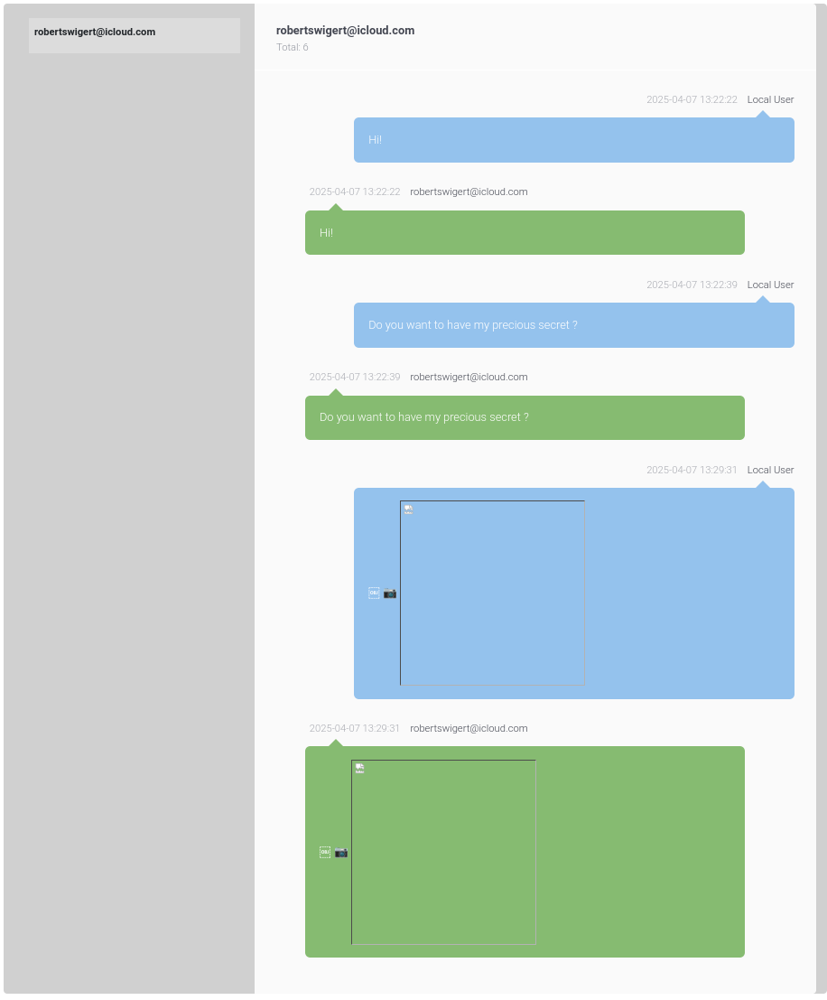
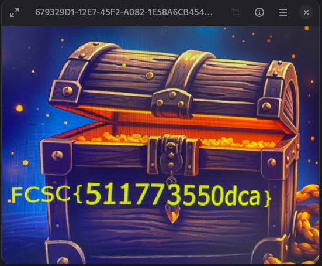

# iForensics - iTreasure

## Challenge

Before handing the phone to customs, its owner had time to send a treasure. Find it.

This challenge is part of a series. The challenges are independent, except for iBackdoor 2/2, which depends on iBackdoor 1&#47;2.

**Difficulty:** ⭐

[Official challenge on Hackropole](https://hackropole.fr/en/challenges/forensics/fcsc2025-forensics-iforensics-4/).

## Solution

### Find the message

The clue points to messages, so I checked `/private/var/mobile/Library/SMS/sms.db`.

The iLEAPP report shows an exchange between `robertswigert@icloud.com` and... `robertswigert@icloud.com`:

[](../../../assets/fcsc/2025/itreasure-messages.png)

An image was sent. The two message records share these values:

| Field | Value |
| --- | --- |
| Message Timestamp | 2025-04-07 13:29:31+00:00 |
| Attachment Timestamp | 2025-04-07 13:29:31+00:00 |
| Attachment Name | 679329D1-12E7-45F2-A082-1E58A6CB454F.HEIC |
| Attachment Mimetype | image/heic |
| Attachment Size (Bytes) | 333465 |
| Chat ID | 2 |

The remaining fields distinguish the outgoing and incoming copies:

| Field | Outgoing copy | Incoming copy |
| --- | --- | --- |
| Message Row ID | 5 | 6 |
| From Me | 1 | 0 |
| Read Timestamp | 2025-04-07 13:33:29+00:00 | 2025-04-07 13:33:30+00:00 |
| Delivered Timestamp | 2025-04-07 13:33:29+00:00 | |
| Message GUID | 87CEFE1E-76F9-4771-BA42-BB020F8312C5 | E827CE34-EF20-4471-961E-898D43E86A56 |

### Locate the attachment

The iLEAPP report did not give the attachment's full path. One option is to search for its filename with `find`. Another is to query the database directly with the [APOLLO `sms_chat.txt` query](https://github.com/mac4n6/APOLLO/blob/master/modules/sms_chat.txt), developed by Sarah Edwards and contributors:

```sql
SELECT
    CASE
        WHEN LENGTH(MESSAGE.DATE)=18 THEN DATETIME(MESSAGE.DATE/1000000000+978307200,'UNIXEPOCH')
        WHEN LENGTH(MESSAGE.DATE)=9 THEN DATETIME(MESSAGE.DATE + 978307200,'UNIXEPOCH')
        ELSE "N/A"
    END "MESSAGE DATE",
    CASE
        WHEN LENGTH(MESSAGE.DATE_DELIVERED)=18 THEN DATETIME(MESSAGE.DATE_DELIVERED/1000000000+978307200,"UNIXEPOCH")
        WHEN LENGTH(MESSAGE.DATE_DELIVERED)=9 THEN DATETIME(MESSAGE.DATE_DELIVERED+978307200,"UNIXEPOCH")
        ELSE "N/A"
    END "DATE DELIVERED",
    CASE
        WHEN LENGTH(MESSAGE.DATE_READ)=18 THEN DATETIME(MESSAGE.DATE_READ/1000000000+978307200,"UNIXEPOCH")
        WHEN LENGTH(MESSAGE.DATE_READ)=9 THEN DATETIME(MESSAGE.DATE_READ+978307200,"UNIXEPOCH")
        ELSE "N/A"
    END "DATE READ",
    MESSAGE.TEXT AS "MESSAGE",
    HANDLE.ID AS "CONTACT ID",
    MESSAGE.SERVICE AS "SERVICE",
    MESSAGE.ACCOUNT AS "ACCOUNT",
    MESSAGE.IS_DELIVERED AS "IS DELIVERED",
    MESSAGE.IS_FROM_ME AS "IS FROM ME",
    ATTACHMENT.FILENAME AS "FILENAME",
    ATTACHMENT.MIME_TYPE AS "MIME TYPE",
    ATTACHMENT.TRANSFER_NAME AS "TRANSFER TYPE",
    ATTACHMENT.TOTAL_BYTES AS "TOTAL BYTES"
FROM MESSAGE
LEFT OUTER JOIN MESSAGE_ATTACHMENT_JOIN ON MESSAGE.ROWID = MESSAGE_ATTACHMENT_JOIN.MESSAGE_ID
LEFT OUTER JOIN ATTACHMENT ON MESSAGE_ATTACHMENT_JOIN.ATTACHMENT_ID = ATTACHMENT.ROWID
LEFT OUTER JOIN HANDLE ON MESSAGE.HANDLE_ID = HANDLE.ROWID;
```

The result gives the full attachment path:

```text
~/Library/SMS/Attachments/9e/14/4C3DF366-1CE1-42F1-9570-C76206181041/679329D1-12E7-45F2-A082-1E58A6CB454F.HEIC
```

[](../../../assets/fcsc/2025/itreasure-treasure-flag.png)

**Flag:** `FCSC{511773550dca}`
